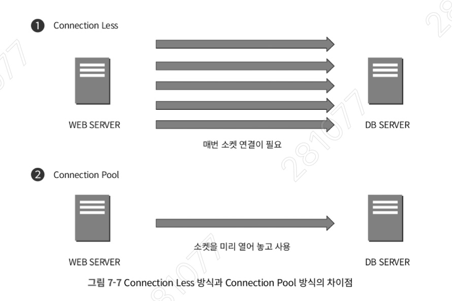
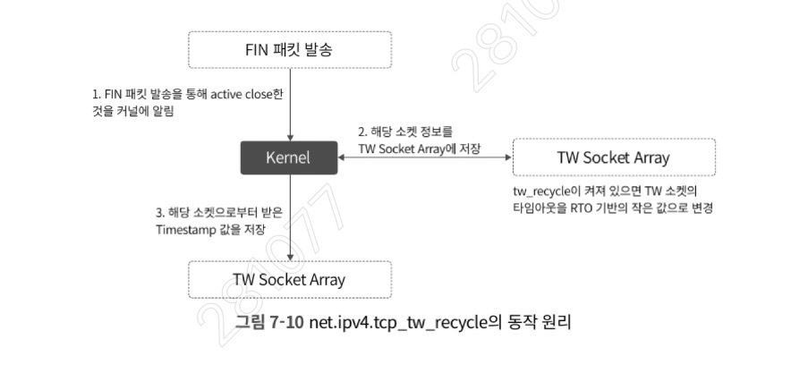
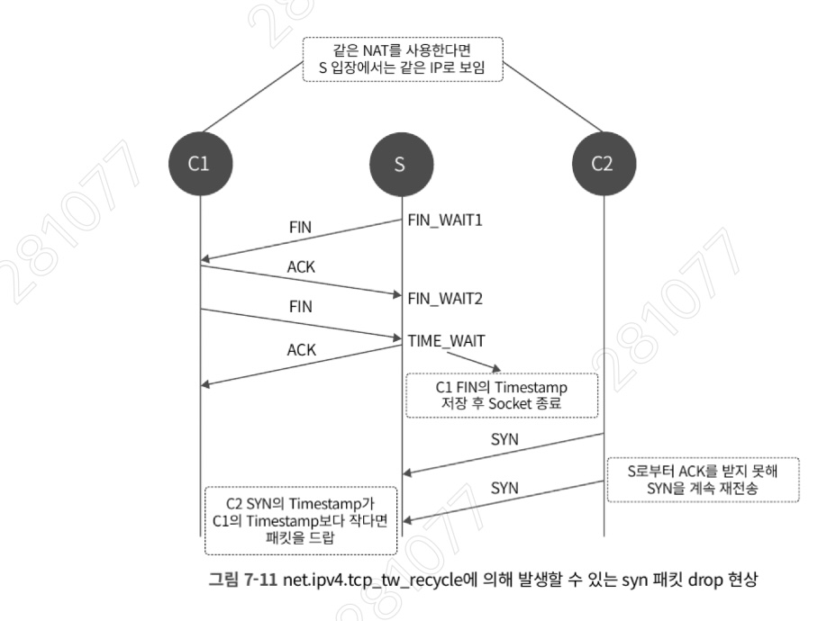
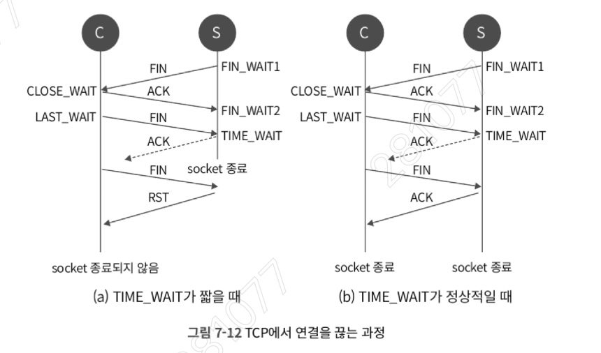
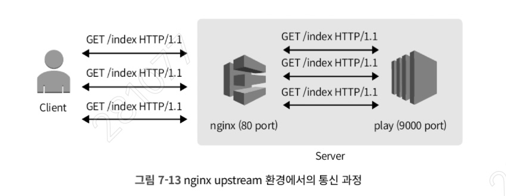
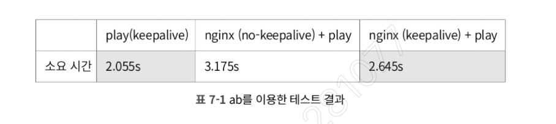

## 7.1 TCP 통신 과정: 통신의 시작과 종료

TCP는 신뢰성 있는 연결을 위해 연결 시 **3-way handshake**를, 연결 종료 시 **4-way handshake** 과정을 거친다.

- **연결 과정 (3-way handshake)**:
    
    1. 클라이언트가 서버에 연결 요청인 **SYN** 패킷을 보낸다.
        
    2. 서버는 응답으로 **SYN+ACK** 패킷을 보낸다.
        
    3. 클라이언트가 다시 **ACK** 패킷을 보내며 연결이 완료된다.
        
- **종료 과정 (4-way handshake)**:
    
    1. 먼저 연결을 끊으려는 쪽(**Active Closer**)이 **FIN** 패킷을 보낸다.
        
    2. 상대방(**Passive Closer**)은 **ACK**를 보낸다.
        
    3. 상대방도 통신을 마친 후 **FIN** 패킷을 보낸다.
        
    4. 먼저 끊으려 했던 쪽이 마지막 **ACK**를 보내고 연결을 정리한다.

---
### Active Closer 발생 상황과 메커니즘 보완

- **Active Closer (능동적 종료자)**:
    
    - **의미**: TCP 연결 상태에서 **"먼저" 연결을 끊겠다고 FIN 패킷을 보내는 쪽**이다.
        
    - **핵심 특징**: 연결 종료를 주도하며, 최종적으로 해당 소켓에 **`TIME_WAIT` 상태가 생성**되는 주체이다.
        
- **Passive Closer (수동적 종료자)**:
    
    - **의미**: 상대방으로부터 FIN 패킷을 받고, 이에 응답하여 **연결 종료를 수용하는 쪽**이다.
        
    - **핵심 특징**: 상대의 종료 요청에 대해 ACK를 보낸 후 자신도 FIN을 보내며, 소켓 상태가 `CLOSE_WAIT`를 거쳐 정리된다.

클라이언트와 서버는 통신 과정에서 상황에 따라 누구나 먼저 연결을 끊는 **Active Closer**가 될 수 있다. 하지만 그 결과로 발생하는 `TIME_WAIT` 소켓의 위치와 시스템에 미치는 영향은 각기 다르다.

- **클라이언트가 Active Closer인 경우**:
    
    - **발생 상황**:
		- **웹 브라우저**: 페이지 로딩을 완료한 후 더 이상 필요한 리소스가 없어 소켓을 정리할 때.
		- **웹 서버(Nginx) → DB/외부 API**: 웹 서버가 클라이언트 입장이 되어 DB 서버나 외부 API 서버와 통신을 마친 후 먼저 연결을 끊을 때.
	- **조건**:
		- **클라이언트 측 Keepalive Timeout 만료**: 서버가 더 기다려줄 의사가 있더라도, 클라이언트 앱(Java, Python 등) 내부의 설정 시간이 먼저 지나면 클라이언트가 먼저 `FIN`을 보낸다.
		- **연결 재사용 설정 부재 (Connection: close 요청)** :
		    - 클라이언트가 요청(Request) 헤더에 `Connection: close`를 명시하여 보낼 때 발생한다.
		    - 이는 클라이언트가 "나는 이번 한 번만 통신하고 바로 연결을 끊겠다"는 의사를 먼저 밝힌 것이다. (주로 HTTP/1.0 사용 시나 일회성 API 호출 시 발생)
		- **프로세스 종료**: 통신 중인 클라이언트 애플리케이션이 재시작되거나 종료될 때 커널이 소켓을 정리하며 먼저 `FIN`을 전송한다.
    - **영향 및 문제점**: 클라이언트 역할을 한 장비(웹 서버 등)에 `TIME_WAIT`이 쌓인다. 요청량이 많을 경우 커널이 외부로 나갈 때 사용하는 로컬 포트가 부족해지는 **포트 고갈(Port Exhaustion)** 장애를 유발할 수 있다.
        
- **서버가 Active Closer인 경우**:
    
    - **발생 상황**: **웹 서버(Nginx) → 사용자**: 서버 설정에 따라 사용자(웹 브라우저)와의 연결을 서버가 먼저 종료할 때.
    - **조건**:
		- **서버 측 Keepalive Timeout 만료**: 서버의 `keepalive_timeout` 설정이 클라이언트보다 짧아 서버가 먼저 참지 못하고 `FIN`을 보낼 때. (예: 서버는 5초 대기인데 클라이언트는 60초 대기인 경우)
		- **서버 설정 제한 (Max Requests)**: 타임아웃 전이라도 한 소켓당 처리 가능한 최대 요청 수(`keepalive_requests`)를 다 채우면 서버는 "이번이 마지막 응답이다"라며 연결을 끊는다.
		- **Connection: close 응답 전송** :
		    - 서버가 응답(Response) 헤더에 `Connection: close`를 실어 보낼 때 발생한다.
		    - 서버가 "내 리소스를 보호해야 하니 이번 응답까지만 주고 바로 끊겠다"라고 클라이언트에게 이별을 통보하는 것
		    - 서비스 운영 중 서버에 `TIME_WAIT`이 비정상적으로 많다면, 애플리케이션이나 웹 서버 설정에서 불필요하게 `close` 헤더를 보내고 있지 않은지 점검해야 한다.
    - **서버가 먼저 끊는 이유 (리소스 보호)**: 서버는 수만 명의 클라이언트를 상대하므로 유휴 연결(Idle Connection)을 무한정 유지할 수 없다. 메모리와 파일 디스크립터(FD)를 선제적으로 회수하여 다른 클라이언트를 받을 공간을 확보하기 위함이다.
    - **영향**: 서버 장비에 `TIME_WAIT` 소켓이 대량 생성되어 서버 전체의 소켓 관리 부하가 늘어난다.

#### Keepalive 설정의 주체와 상호작용

Keepalive는 어느 한쪽만 가지는 값이 아니라, 클라이언트와 서버가 각자의 목적을 위해 모두 가질 수 있는 설정이다.

- **클라이언트의 Keepalive**: "다음 요청을 보낼 테니 이 소켓을 재사용할 수 있게 유지해 달라"는 **요청**이다. (`Connection: keep-alive` 헤더)
    
- **서버의 Keepalive**: "연결을 유지해 주겠지만, 내 리소스를 위해 최대 **N초(Timeout)**  까지만 기다리겠다"는 **제한** 이다.
    
- **결과**: 두 설정값 중 **더 짧은 시간**을 기준으로 연결 유지가 결정된다. 만약 서버의 타임아웃이 클라이언트보다 짧다면 서버가 먼저 연결을 끊게 되며(Active Closer), 이때 서버 쪽에 `TIME_WAIT`이 남게 된다.

+ **서버 입장에서의 '이상적인' 종료 시나리오** 실무에서 가장 이상적인 시나리오는 클라이언트가 먼저 연결을 종료하여 **서버에는 `TIME_WAIT`을 남기지 않는 것**이다. 
	+ 서버에 수만 개의 `TIME_WAIT`이 쌓이면 메모리 점유는 물론, 커널이 소켓 테이블을 조회할 때 성능 저하가 발생할 수 있기 때문이다.
	+ 엔지니어는 서버의 `keepalive_timeout`을 클라이언트의 일반적인 요청 간격보다 **약간 더 길게** 설정하여, 가급적 클라이언트가 먼저 끊고 나가도록(Passive Closer로 남도록) 유도하는 전략을 취한다.
	+ 단, 이 시간이 너무 길면 유휴 연결(Idle Connection)이 너무 많아져 서버 리소스가 낭비되므로, 트래픽 특성에 맞는 **적정 임계치**를 찾는 것이 중요

## 7.2 TIME_WAIT 소켓의 문제점: 소켓 자원의 점유

먼저 연결을 종료하려 시도한 **Active Closer** 쪽에는 **TIME_WAIT** 상태의 소켓이 생성된다. 
이는 연결 종료 후에도 패킷의 유실이나 뒤늦은 도착에 대비해 소켓을 일정 시간 유지하는 상태이다.

- **포트 고갈 문제**: 
	- 리눅스 커널은 외부와 통신 시 `net.ipv4.ip_local_port_range`에 정의된 범위 내의 로컬 포트를 할당한다. 
	- TIME_WAIT 소켓이 이 범위를 모두 점유하면 더 이상 할당할 포트가 없어 애플리케이션 타임아웃이 발생한다.
    
- **성능 저하**: 잦은 TCP 연결/종료는 반복적인 3-way handshake를 유발하여 응답 속도를 저하시킨다. 이를 방지하기 위해 **Connection Pool**과 같은 연결 재사용 방식이 권장된다.
    

## 7.3 클라이언트에서의 TIME_WAIT: 서버가 클라이언트가 되는 상황

일반적으로 서버에 TIME_WAIT이 생긴다고 오해하기 쉽지만, 이는 **먼저 연결을 끊는 쪽에 발생**한다.

- **발생 상황**: 웹 서버(WEB)가 DB 서버나 외부 API 서버에 요청을 보낼 때, 웹 서버는 클라이언트 역할을 수행한다. 이때 웹 서버가 연결을 먼저 끊으면 웹 서버 쪽에 TIME_WAIT 소켓이 쌓이게 된다.
    
- **소켓 식별**: 커널은 소켓을 **[출발지 IP, 출발지 Port, 목적지 IP, 목적지 Port]** 4개 값의 쌍으로 관리한다. 동일한 목적지 정보에 대해 **로컬 포트** 가 TIME_WAIT 상태라면 해당 포트는 재사용할 수 없다.
    

## 7.4 net.ipv4.tcp_tw_reuse: 소켓 재사용 설정

로컬 포트 고갈 문제에 대응하기 위한 커널 파라미터 중 하나이다.

- **동작 원리**: 외부로 요청을 보낼 때, 커널이 로컬 포트를 할당하는 과정에서 기존에 사용 중인 TIME_WAIT 상태의 소켓이 있다면 이를 재사용할 수 있게 해준다.
    
- **설정 방법**: `net.ipv4.tcp_tw_reuse = 1` (enable) 로 설정한다.
	- `TIME_WAIT` 상태가 된 지 **1초**가 지난 소켓들을 대상으로 재사용을 시도
    
- **필수 조건**: 이 설정은 반드시 **timestamp** 기능과 함께 사용해야 하며, `net.ipv4.tcp_timestamps = 1` 값이 활성화되어 있어야 정상 동작한다.
	- why?
		- `tw_reuse`는 기존 소켓의 통로를 재사용하므로, **이전 연결에서 네트워크를 떠돌던 낡은 패킷(Stale Packet)** 이 뒤늦게 도착해 새로운 연결의 데이터로 오인될 위험이 있다.
		- **패킷 오염 방지 (PAWS)**: `tcp_timestamps`가 활성화되면 모든 패킷에 전송 시점의 시간 정보가 찍힌다. 커널은 **PAWS(Protection Against Wrapped Sequence numbers)** 메커니즘을 통해, 마지막에 수신된 타임스탬프보다 이전의(작은) 값을 가진 패킷이 들어오면 이를 '지연된 낡은 패킷'으로 간주하고 즉시 드랍한다.
		- **안전장치**: 타임스탬프가 없다면 커널은 새로 맺은 연결에 들어온 패킷이 '지연된 예전 패킷'인지 '지금의 패킷'인지 구별할 방법이 없다. 따라서 안전을 위해 타임스탬프가 꺼져 있으면 `tw_reuse` 설정은 무시된다.
    
## 7.5 ConnectionPool 방식 사용하기: 근본적인 해결책

`tw_reuse`가 이미 발생한 소켓을 재사용하는 방안이라면, **Connection Pool**은 소켓이 `TIME_WAIT` 상태로 빠지는 것 자체를 최소화하는 더 근본적인 방법이다.

- **동작 차이** :
	- 
    
    - **Connection Less**: 요청마다 [연결-데이터 전송-종료]를 반복한다. 매번 3-way/4-way handshake가 발생하여 리소스 낭비가 심하다.
        
    - **Connection Pool**: 소켓을 미리 열어두고 필요할 때 꺼내 쓴다. 통신이 끝나도 연결을 끊지 않고 유지하므로 불필요한 핸드셰이크가 사라진다.
        
- **실증 테스트 :
	- Connection Less 방식 테스트 스크립트
		- ```python
			#!/usr/bin/python
			import redis
			import time
			
			count = 0
			while True:
			    if count > 10000:
			        break
			    # 요청마다 새로운 연결 생성
			    r = redis.Redis(host='redis.server', port=6379, db=0)
			    print "SET"
			    r.setexcount, count, 10)
			    count += 1
		  ```
	- Connection Pool 방식 테스트 스크립트
		- ```python
			#!/usr/bin/python
			import redis
			import time
			
			count = 0
			# 연결 풀 생성하여 세션을 미리 열어둠
			pool = redis.ConnectionPool(host='infra-redis.redis.iwilab.com', port=6379, db=0)
			while True:
			    if count > 10000:
			        break
			    # 미리 열어둔 세션을 가져와서 사용
			    r = redis.Redis(connection_pool=pool)
			    print "SET"
			    r.setex(count, count, 10)
			    count += 1
		  ```
    
    - Redis 연결 시 매번 세션을 생성(Less)하면 초당 수많은 `TIME_WAIT` 소켓이 생성되지만, Connection Pool을 사용하면 단 하나의 `ESTABLISHED` 소켓만 유지되는 것을 확인할 수 있다.
    - Connection Pool 방식이 효율적이지만, 무조건 풀의 크기를 크게 잡는 것은 위험하다. 풀의 크기는 곧 서버의 파일 디스크립터(FD) 점유와 직결되며, 대상 서버(DB 등) 입장에서도 동시 접속 가능한 연결 수(`max_connections`) 제한이 있기 때문이다. 
	    - 따라서 애플리케이션의 처리량(TPS)과 대상 서버의 수용 능력을 고려하여 최적의 `Min/Max Pool Size`를 산정하는 것이 필수적이다.
	- **Connection Leak(연결 누수) 주의**: 풀에서 소켓을 꺼내 쓴 뒤, 예외 처리가 미흡하여 풀로 다시 반납하지 않으면 소켓이 계속 점유된 상태로 남는 '연결 누수'가 발생한다. 이는 결국 풀이 가득 차서 신규 요청이 대기(Wait) 상태에 빠지는 장애로 이어지므로, 반드시 `try-finally` 구문을 통해 안전하게 소켓을 반환해야 한다.
        

## 7.6 서버 입장에서의 TIME_WAIT 소켓

서버는 일반적으로 요청을 받아들이는 수동적인 입장이지만, 특정 설정에 따라 서버가 먼저 연결을 끊어 `TIME_WAIT`이 발생할 수 있다.

- **발생 원인**: 서버 설정 중 `keepalive_timeout`이 0이거나 매우 짧을 때, 혹은 응답 헤더에 `Connection: close`가 포함될 때 서버가 **Active Closer**가 된다.
    
- **확인 방법**: 
	- ```bash
	   [root@server nginx]# netstat -napo | grep -i :80
		tcp 0 0 172.16.33.136:80 172.16.33.137:52496 TIME_WAIT - timewait (46.22/0/0)
		tcp 0 0 172.16.33.136:80 172.16.33.137:52508 TIME_WAIT - timewait (57.05/0/0)
		tcp 0 0 172.16.33.136:80 172.16.33.137:52511 TIME_WAIT - timewait (58.03/0/0)
		tcp 0 0 172.16.33.136:80 172.16.33.137:52509 TIME_WAIT - timewait (57.59/0/0)
		```

	- `netstat`을 통해 서버 포트(예: 80)에 `TIME_WAIT` 상태의 소켓이 다수 존재하는지 확인한다.
    

## 7.7 net.ipv4.tcp_tw_recycle: 사용에 주의가 필요한 파라미터

서버 입장에서 `TIME_WAIT`을 빠르게 회수하기 위해 사용했던 파라미터이지만, 치명적인 부작용이 있다.
- 서버가 클라이언트에게 "그만 나가"라고 할 때 (Inbound 대응)
	- 서버의 `keepalive_timeout` 만료, 혹은 응답 헤더에 `Connection: close` 명시 케이스
	- 서버에 `TIME_WAIT`이 쌓이면서, 소켓 리소스(메모리/FD)가 점유된다.
	- 이때 서버의 리소스를 아끼기 위해 `tcp_tw_recycle`을 썼지만 NAT 환경의 사용자 패킷을 드랍하는 부작용 때문에 퇴출되었다.
- 서버가 DB/API 서버에게 요청을 마쳤을 때 (Outbound 대응)
	- 앞서 클라이언트 `TIME_WAIT` 처리 케이스와 동일하게 `tw_reuse`와 `Connection Pool`을 사용 가능

- **동작 원리** : 
	- 
	- `TIME_WAIT`의 타임아웃을 RTO(Retransmission Timeout) 기반의 매우 짧은 값으로 변경하고, 마지막 패킷의 **timestamp**를 저장한다.
		- 리눅스 커널에서 일반적인 `TIME_WAIT` 상태는 **2MSL(보통 60초)** 동안 유지된다. 
		- 대신, 해당 연결의 **RTO(Retransmission Timeout, 재전송 타임아웃)** 값을 기준으로 대기 시간을 변경
			- RTO는 보통 밀리초($ms$) 단위이므로, 60초 동안 점유될 소켓이 **수백 $ms$ 만에** 사라진다
			- 소켓이 눈 깜짝할 새 정리되어 다시 '빈 자리가 되는(Recycle)' 것
		- 소켓을 빨리 정리하면 7.4절의 '지연 패킷' 문제가 발생할 수 있다. 이를 막기 위해 커널은 마지막으로 들어온 패킷의 **Timestamp**를 메모리에 저장해 둔다.
			- **로직**: "소켓은 정리했지만, 이 IP에서 오는 다음 패킷의 Timestamp가 내가 저장한 것보다 작으면(과거 패킷이면) 드랍한다."
    
- **부작용**: 
	- 
	- 동일한 NAT 환경(공유 IP 사용 등) 뒤에 있는 여러 클라이언트(C1, C2)가 접속할 때 문제가 발생한다.
    
    - 서버가 C1의 timestamp를 저장한 상태에서, 이보다 더 작은(과거의) timestamp를 가진 C2의 SYN 패킷이 도착하면 서버는 이를 잘못된 패킷으로 판단하고 **드랍(Drop)** 한다.
		- 즉, 서버는 C2를 '과거의 패킷을 보내는 잘못된 클라이언트'로 오해하고 C2의 연결 요청(SYN)을 조용히 무시(Drop)해 버린다.
        
- **결론**: 리눅스 커널 4.12 버전부터 이 기능은 완전히 삭제됨.
	- 현재 리눅스 환경에서는 `tw_reuse`를 사용하거나 애플리케이션 레벨의 `keepalive` 튜닝을 권장
    

## 7.8 keepalive 사용하기: 서버 성능 향상

서버에서 `keepalive`를 활성화하면 세션을 일정 시간 유지하여 응답 속도를 높이고 소켓 생성을 줄일 수 있다.

- **nginx 설정**: `keepalive_timeout 10;`과 같이 설정하면 첫 요청 후 10초 동안 연결이 유지된다. (기본값이 HTTP/1.0인 경우 `keepalive` 설정이 무시될 수 있으므로 주의)
    
- **효과**: 클라이언트가 연속 요청을 보낼 때 새로운 소켓을 열지 않고 기존 연결을 사용하므로, 서버에 쌓이는 `TIME_WAIT` 소켓이 획기적으로 줄어든다.


## 7.9 TIME_WAIT 상태의 존재 이유: 반드시 필요한 흔적

`TIME_WAIT`은 서비스에 문제를 일으키는 골칫거리처럼 보이지만, 안정적인 TCP 통신을 위해 반드시 존재해야 하는 상태이다.

- **패킷 유실 시 안정적인 종료 보장** :
	- 
    - **상황 (a) - TIME_WAIT이 매우 짧거나 없을 때**: 서버(S)가 보낸 마지막 `ACK`가 유실되면, 클라이언트(C)는 `FIN`에 대한 응답을 못 받았다고 판단해 `FIN`을 재전송한다. 하지만 서버 소켓이 이미 종료되었다면 서버는 `RST`(Reset) 패킷을 보내게 되고, 클라이언트는 비정상적인 종료 상태인 `LAST_ACK`에 머물게 된다.
        
    - **상황 (b) - TIME_WAIT이 정상적일 때**: 서버 소켓이 일정 시간 유지되고 있다면, 클라이언트가 재전송한 `FIN`을 받아 다시 `ACK`를 보내줌으로써 양쪽 모두 정상적으로 종료될 수 있다.
        
- **지연 패킷 처리**: 이전 연결에서 뒤늦게 도착한 패킷이 새로운 연결의 패킷으로 오해받아 데이터가 오염되는 것을 방지한다.
    

## 7.10 Case Study: nginx upstream에서 발생하는 TIME_WAIT

실무에서 자주 사용되는 `nginx`(웹 서버)와 `upstream`(앱 서버, 예: Tomcat/Netty) 구조에서의 사례이다.

- **발생 상황**: 
	- 
	- nginx와 앱 서버 사이에서 `keepalive`를 사용하지 않으면 매 요청마다 TCP 연결/종료가 발생하며 nginx 쪽에 `TIME_WAIT` 소켓이 쌓인다.
    
- **문제점**:
    
    1. **포트 고갈**: nginx가 앱 서버로 요청을 보낼 로컬 포트가 부족해진다. (`tw_reuse`로 어느 정도 완화 가능)
        
    2. **성능 저하**: 불필요한 핸드셰이크 반복으로 서비스 응답 속도가 지연된다.
        
- **테스트 결과**:
	- 
    - `ab` 툴을 이용한 테스트 결과, nginx와 앱 서버 사이에 `keepalive`를 설정했을 때가 설정하지 않았을 때보다 응답 속도가 약 **15% 이상 향상**되었다.
        

