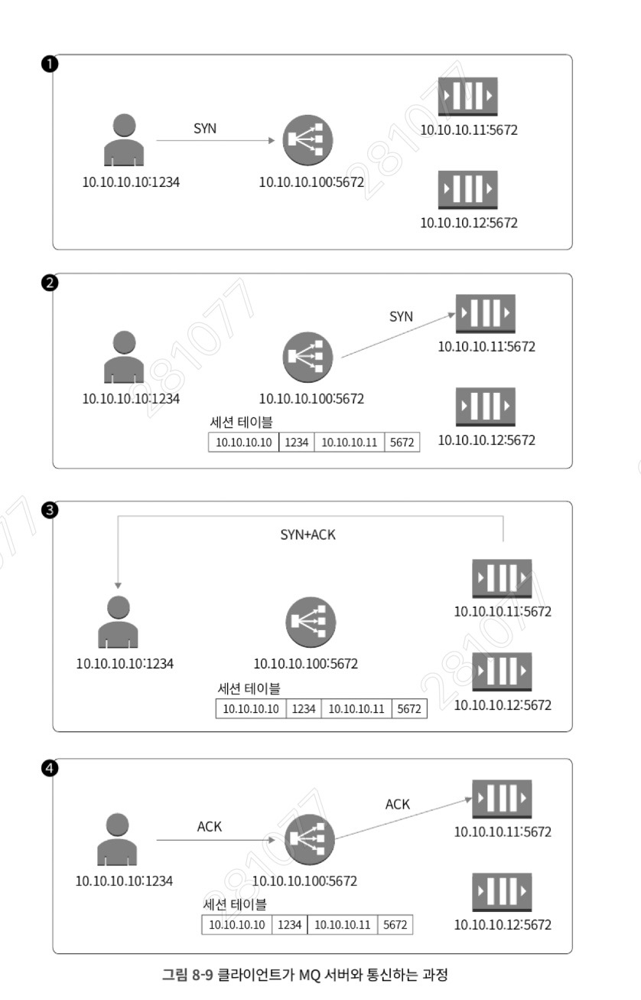
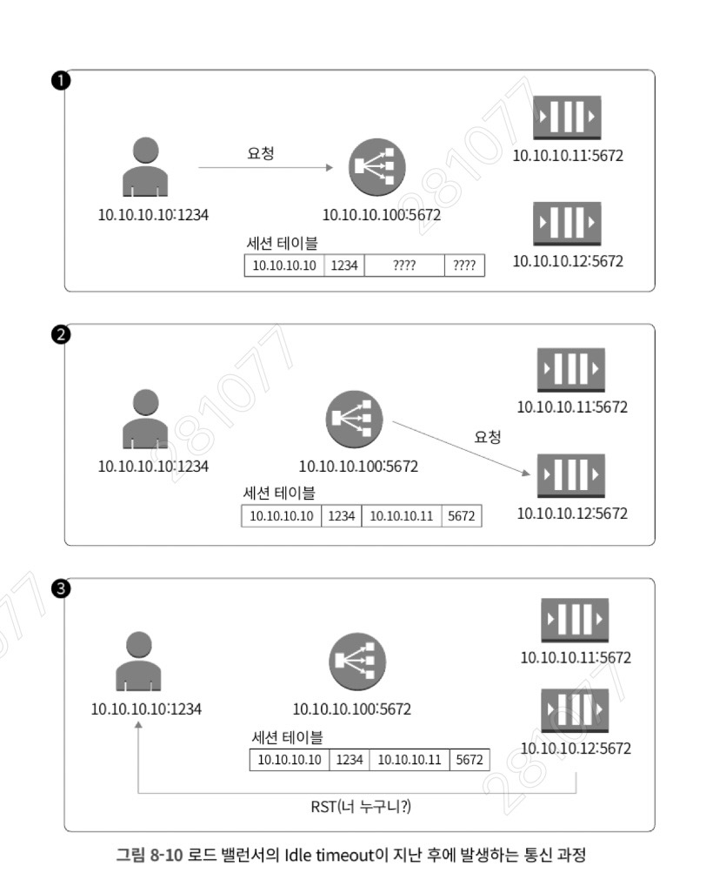
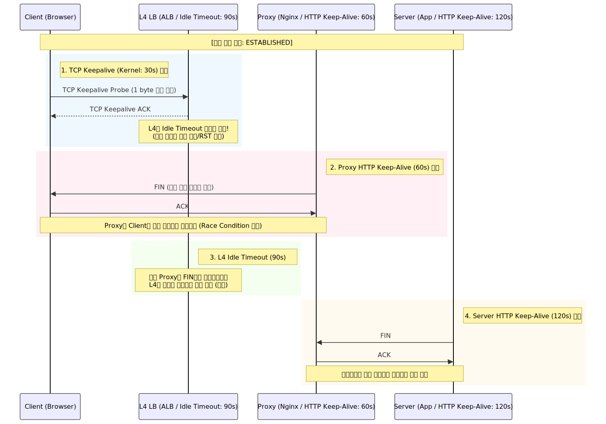

## 8.1 TCP Keepalive란

TCP 통신에서 세션을 유지하기 위한 메커니즘을 다룬다.

- **배경**: TCP 통신을 위해서는 반드시 **3-way handshake** 과정이 필요하다. 하지만 통신이 빈번하고 지속적인 경우, 매번 이 과정을 반복하는 것은 비효율적이다.
    
- **정의**: 처음 맺어 놓은 세션을 끊지 않고 계속 유지하여 재사용하기 위한 기능이다.
    
- **작동 방식**: 일정 시간 동안 통신이 없으면, 연결된 세션의 양 종단이 서로 살아있는지 확인하기 위해 아주 작은 크기의 패킷을 보낸다.
    
- **특징**: 양쪽 모두가 보낼 필요는 없으며, 한쪽에서만 이 기능을 사용해도 세션은 유지된다. 확인 패킷을 주고받으면 타이머는 다시 원래 값으로 돌아가 카운트를 시작한다.
    
- **확인 방법**: `netstat` 명령어를 통해 현재 소켓이 Keepalive를 지원하는지 확인할 수 있다.
	- ```sh
	  $ netstat -atno
		Active Internet connections (straighten servers and established)
		Proto Recv-Q Send-Q Local Address           Foreign Address         State       Timer
		tcp        0      0 10.0.0.1:80             1.2.3.4:54321           ESTABLISHED keepalive (28.45/0/0)
	  ```
	- **`ESTABLISHED`**: 현재 클라이언트와 서버가 연결되어 데이터를 주고받을 수 있는 상태
	- **`keepalive`**: 현재 이 세션에 **TCP Keepalive**가 활성화되어 있다는 것
		- 만약 애플리케이션에서 `SO_KEEPALIVE` 옵션을 켜지 않았다면 off
			- ```sh
			  # keepalive 대신 off가 나타납니다.
				tcp  0  0 10.0.0.1:80  1.2.3.4:54321  ESTABLISHED  off (0.00/0/0)
			  ```
		- **뒤의 0/0**: 재시도 횟수와 간격을 의미
	

## 8.2 TCP Keepalive의 파라미터들

커널에서 제공하는 세 가지 핵심 파라미터를 통해 Keepalive의 동작을 제어한다.

```sh
# /etc/sysctl.conf
net.ipv4.tcp_keepalive_time = 240    # 첫 번째 Probe를 보낼 시간
net.ipv4.tcp_keepalive_intvl = 3   # 이후 재시도 간격
net.ipv4.tcp_keepalive_probes = 30   # 최종 응답 없으면 끊을 횟수

# 적용 명령: sysctl -p
```

- **net.ipv4.tcp_keepalive_time**: Keepalive 소켓의 유지 시간을 의미한다. 
	- 이 시간이 지나면 연결 확인을 위한 첫 번째 패킷을 보낸다. (기본값 보통 7200초/2시간, 예제에서는 240초)
    
- **net.ipv4.tcp_keepalive_probes**: 응답이 없을 때 패킷을 보낼 최대 재전송 횟수
    
- **net.ipv4.tcp_keepalive_intvl**: 첫 패킷에 응답이 없을 경우, 다음 재전송 패킷을 보내는 간격(초)을 의미
    

> **정리**: 최초 `tcp_keepalive_time`만큼 기다린 후 패킷을 보내고, 응답이 없으면 `tcp_keepalive_intvl` 간격으로 `tcp_keepalive_probes` 횟수만큼 더 보낸다. 이후에도 응답이 없으면 연결을 끊는다.

## 8.3 TCP Keepalive와 좀비 커넥션

실무에서 Keepalive가 가장 큰 효과를 발휘하는 부분은 **좀비 커넥션(Zombie Connection)** 방지이다.

- **문제 상황**: 네트워크 장비(스위치 등) 장애나 비정상적인 종료로 인해 FIN 패킷이 전달되지 못하면, 한쪽 종단은 연결이 끊어진 줄 모르고 **ESTABLISHED** 상태를 계속 유지하게 된다.
    
- **실습 시나리오 (Redis/MySQL 예제)**:
    
    1. 애플리케이션(Python)과 DB 서버를 연결한다.
    2. DB 서버에서 mysqld를 종료한다.
    3. 다시 한번 두 서버를 연결한다.
    4. `iptables`를 이용해 DB 서버에서 나가는 패킷을 **DROP** 시킨다.
    5. DB 서버 프로세스를 종료한다.
    6. 클라이언트 입장에서는 FIN 패킷을 받지 못해 소켓이 여전히 ESTABLISHED 상태로 남는다.

- 2번 케이스: DB 서버(`mysqld`) 프로세스만 `kill`한 케이스로, DB 커널이 클라이언트에 **FIN** 송신 성공하여 애플리케이션이 **`CLOSE_WAIT`** (정상적인 종료 절차 진입) 상태임을 확인 할 수 있었다.
	- ```sh
	  # DB 서버에서 실행
		$ systemctl stop mysqld
		
		# 클라이언트에서 확인
		$ netstat -atno | grep 3306
		tcp  0  0 10.0.0.1:54321  10.0.0.2:3306  CLOSE_WAIT  off (0.00/0/0)
	  ```

- 4번 케이스: **`iptables DROP`** 설정 후 DB 프로세스 `kill`한 케이스, DB 커널의 FIN 패킷이 **네트워크에서 차단됨** 
	- 클라이언트 상태는 여전히 **`ESTABLISHED`** 로 상대방이 죽은 줄 모른다. -> 좀비 커넥션 발생 (자원 낭비 및 장애 유발) 가능
	- **해결**: Keepalive 옵션이 켜져 있다면, 설정된 타이머가 만료된 후 확인 패킷을 보낸다. 응답이 없으므로 정해진 횟수만큼 재시도한 후, 최종적으로 연결이 끊어졌음을 인지하고 소켓을 정리(RST 패킷 전송 및 소켓 닫기)한다.
		- ```sh
		  # 1. DB 서버에서 나가는 패킷을 차단 (리스팅 8-5 예시)
			$ iptables -A OUTPUT -p tcp --sport 3306 -j DROP
			
			# 2. DB 서버 프로세스 종료
			$ systemctl stop mysqld
			
			# 3. 클라이언트에서 확인 (리스팅 8-6 예시)
			$ netstat -atno | grep 3306
			tcp  0  0 10.0.0.1:54321  10.0.0.2:3306  ESTABLISHED  off (0.00/0/0)
		  ```
    
- **분석**: 와이어샤크 덤프 결과, 마지막 통신 후 설정된 시간(예: 60초)이 지나면 Keepalive 패킷을 보내고, 응답이 없자 커널 파라미터에 정의된 간격(10초)대로 재전송한 후 세션을 종료하는 것을 확인할 수 있다.

#### 하프 오픈(Half-Open) 커넥션의 위험성

서버에 좀비 커넥션(Half-Open)이 누적되면 **File Descriptor(FD) 고갈** 문제가 발생한다. 리눅스 시스템은 프로세스당 생성할 수 있는 소켓 수에 제한이 있으므로, 실제 통신하지 않는 유령 세션들이 이 자리를 차지하면 새로운 클라이언트의 접속을 받을 수 없게 된다. 따라서 방화벽이나 L4 스위치 뒤에 있는 서버라면 반드시 적절한 TCP Keepalive 설정을 통해 유휴 자원을 회수해야 한다.

---
## 8.4 TCP Keepalive와 HTTP Keep-Alive

많은 엔지니어가 혼동하는 개념이지만, 두 기능은 작동하는 계층(Layer)과 목적이 다르다.
## 1. TCP Keepalive vs HTTP Keep-Alive

많은 엔지니어가 혼동하는 개념이지만, 두 기능은 작동하는 계층(Layer)과 목적이 다르다.

- **동작 방식의 차이**:
    
    - **TCP Keepalive**: 두 종단 간의 연결 유지 여부를 확인하기 위해 커널 레벨에서 아주 작은 패킷을 주고받는다.
	    - **(L4)**: OS 커널 레벨에서 동작한다. 목적은 **'연결의 유효성 확인'** 과 **'좀비 커넥션 방지'** 이다. 통신이 없어도 세션이 살아있는지 확인하는 것이 핵심이다.
        
    - **HTTP Keep-Alive**: HTTP/1.1에서 지원하며, 웹 서버(Apache, Nginx 등) 애플리케이션 레벨에서 설정한다. 
	    - **(L7)**: 목적은 **'연결의 재사용(Persistent Connection)'** 이다. 한 번의 TCP 연결로 여러 개의 HTTP 요청/응답을 처리하여 핸드셰이크 비용을 줄이는 것이 핵심이다.

        
- **실습 분석 (Apache 예제)**:
    
    - 커널의 `tcp_keepalive_time`을 30초로, Apache의 `KeepAliveTimeout`을 60초로 설정하여 테스트한다.
        
    - **코드 8-16, 8-17**: `netstat`으로 확인 시, 소켓에 Keepalive 타이머가 작동하는 것을 볼 수 있다. 30초마다 커널이 Keepalive 패킷을 보내 연결을 확인하며, 최종적으로 Apache 설정값인 60초가 지나면 서버가 먼저 FIN 패킷을 보내 연결을 종료한다.
	    - ```sh
			# 1. 처음 확인 (첫 번째 30초 카운트다운 중)
			$ netstat -atno | grep 80
			tcp        0      0 10.0.0.1:54321          10.0.0.2:80             ESTABLISHED keepalive (24.10/0/0)
			
			# 2. 첫 번째 Probe 발송 후 (다시 30초 리셋 - 아파치가 60초라 아직 살아있음)
			$ netstat -atno | grep 80
			tcp        0      0 10.0.0.1:54321          10.0.0.2:80             ESTABLISHED keepalive (29.10/0/0)
			
			# 3. 서버 패킷 DROP 및 프로세스 종료 후 (두 번째 Probe 발송 시도)
			# 이제부터 대답이 없으므로 '진짜' 재시도(Retry) 모드로 진입
			$ netstat -atno | grep 80
			tcp        0      0 10.0.0.1:54321          10.0.0.2:80             ESTABLISHED keepalive (8.12/1/0)
			
			# 4. 계속해서 응답이 없어 다음 재시도 중
			$ netstat -atno | grep 80
			tcp        0      0 10.0.0.1:54321          10.0.0.2:80             ESTABLISHED keepalive (7.50/2/0)
	      ```
        
- **결론**: 두 설정이 동시에 되어 있다면 각각의 설정값에 맞춰 독립적으로 동작한다. HTTP Keep-Alive가 설정되어 있다면 해당 설정값을 기준으로 연결이 유지되므로, TCP Keepalive 값과 달라도 의도한 대로 동작한다.
    

## 8.5 Case Study - MQ 서버와 로드 밸런서

로드 밸런서 하단에 위치한 MQ(Message Queue) 서버에서 발생하는 간헐적 타임아웃 문제를 통해 Keepalive의 중요성을 살핀다.

- 
- 
  (출처: DevOps와 SE를 위한 리눅스 커널 이야기)
  

- **문제 현상**: 로드 밸런서의 **Idle timeout**이 지나 세션 테이블에서 정보가 삭제된다 -> 서버에는 소켓이 **ESTABLISHED** 상태로 남아있으나, 클라이언트는 간헐적으로 타임아웃이 발생하거나 서버로부터 **RST(Reset)** 패킷을 받는 현상이 발생한다.
    
- **원인 - 로드 밸런서의 Idle Timeout**:
    
    - 로드 밸런서는 클라이언트와 서버 사이의 세션 정보를 **세션 테이블**에 저장한다.
        
    - 일정 시간(Idle Timeout) 동안 패킷 흐름이 없으면 로드 밸런서는 세션 테이블에서 해당 정보를 삭제한다. (중요: 이때 종단 서버나 클라이언트에게 세션이 끊겼음을 알리지 않는다.)
        
- **DSR(Direct Server Return) 구조의 특성**:
    
    - 요청은 로드 밸런서를 거치지만, 응답은 서버가 클라이언트에게 직접 보낸다.
        
    - 로드 밸런서의 세션 테이블이 만료된 후 클라이언트가 요청을 보내면, 로드 밸런서는 이를 신규 세션으로 인식하여 세션 테이블에 기록된 서버가 아닌 다른 서버로 패킷을 전달할 수 있다.
        
    - **결과**: 핸드셰이크(SYN) 과정 없이 데이터 패킷을 받은 서버는 "너 누구니?"라는 의미로 **RST 패킷**을 보내게 되며, 클라이언트는 연결 오류를 경험하게 된다.

- **해결 방법 - 커널 파라미터 수정**:
    
    - 로드 밸런서의 Idle timeout(예: 120초)보다 짧은 주기로 패킷이 흐르도록 설정한다.
        
    - **설정 예시**: `tcp_keepalive_time = 60`, `tcp_keepalive_probes = 3`, `tcp_keepalive_intvl = 10`. 이렇게 설정하면 최악의 경우에도 120초 이내에 패킷이 발생하여 로드 밸런서의 세션 테이블 유지를 돕는다.

- **주의사항 (RabbitMQ 예제)**:
    
    - OS 커널 파라미터를 수정하더라도, 애플리케이션(소켓) 자체에서 `SO_KEEPALIVE` 옵션을 사용하지 않으면 효과가 없다. 
        
    - RabbitMQ 환경 설정 파일(`rabbit.config`) 등에서 `{keepalive, true}`와 같은 옵션을 명시적으로 활성화해야 `netstat` 확인 시 Keepalive 타이머가 정상 동작한다.

---
### 최종 정리

#### 1. 세 가지 타임아웃의 정의와 동작 방식

|**구분**|**TCP Keepalive (L4/Kernel)**|**Idle Timeout (L4/Network 장비)**|**HTTP Keep-Alive (L7/App)**|
|---|---|---|---|
|**주체**|리눅스 OS 커널 (Kernel)|로드 밸런서(ALB), 방화벽 등|웹 서버(Nginx, Apache), 앱, DB|
|**목적**|연결 유효성 확인 및 L4 리셋|유휴 자원 회수 (세션 테이블 관리)|연결 재사용 (Handshake 감소)|
|**종료 방식**|**종료하지 않음** (확인 패킷만 전송)|**세션 삭제** (알림 없이 장부에서 제거)|**FIN 전송** (4-way handshake 종료)|
|**핵심 기작**|1바이트 빈 ACK 패킷(Probe) 전송|패킷 흐름 없으면 세션 정보 파기|마지막 응답 후 유휴 시간 카운트|

#### 2. 세션 유지의 핵심: "속임수와 인내심"

시스템이 장애 없이 돌아가기 위해서는 아래의 상호작용이 완벽하게 맞물려야 한다.

- **TCP Keepalive의 트릭**: 데이터 통신이 없어도 커널이 주기적으로(예: 30초) **1바이트짜리 ACK 패킷(Probe)**을 보낸다. 이 패킷은 실제 데이터는 아니지만, 중간에 있는 **L4 장비(ALB)의 Idle Timeout 타이머를 계속 0으로 리셋**시켜 세션이 강제로 삭제되는 것(좀비 커넥션/RST 발생)을 방지한다.
    
- **Idle Timeout의 위험성**: 전용 L4 장비는 자원 절약을 위해 말없이 세션을 지운다. 이때 종단(Client/Server)은 연결이 끊긴 줄 모르고 패킷을 보냈다가, L4로부터 **RST(Reset)** 패킷을 받고 통신 에러가 발생한다. 이를 막으려면 반드시 **TCP Keepalive < Idle Timeout** 공식이 성립해야 한다.
    
- **HTTP Keep-Alive의 예의**: 애플리케이션 레벨에서 종료할 때는 `FIN` 패킷을 보내 서로 확인 과정을 거친다. 이것이 가장 안전하고 정상적인 종료 방식이다.

#### 3. Best Practice

장애를 방지하는 가장 이상적인 설계는 **"안쪽(Server)으로 갈수록 더 인내심이 깊어야 한다"** 는 것이다.



.svg)

#### **권장 공식: TCP Keepalive < Proxy HTTP KA < L4 Idle Timeout < Server HTTP KA < DB Timeout**

1. **TCP Keepalive (30s)**: 가장 부지런히 움직이며 계속 살아있는지 패킷을 보내서, 중간 장비(L4)의 세션을 유지시킨다.
    
2. **HTTP Keep-Alive (Proxy: 60s)**: 서버보다 먼저 `FIN`을 던진다. 클라이언트를 먼저 퇴장시켜야 서버가 종료할 때 발생하는 **레이스 컨디션(Race Condition)** 을 막을 수 있다.
    
3. **Idle Timeout (L4: 90s)**: **'통로'**로, Nginx가 60초에 보낸 **FIN 패킷이 클라이언트에게 무사히 전달될 수 있도록** 90초까지 길을 열어둔다.
	1. 프록시가 이미 60초에 정상 종료를 했으므로, 90초가 되었을 때 아무 충돌 없이 장부를 비울 수 있다
	2. 만약 이게 50초면 Nginx의 FIN은 ALB에서 차단되어 RST가 발생하게 된다.
    
4. **HTTP Keep-Alive (Server: 120s)**: 실제 데이터 주인은 모든 앞단 과정이 끝날 때까지 최후까지 인내한다.
    
5. **DB wait_timeout (3600s+)**: 앱 서버가 커넥션 풀을 정리할 때까지 DB는 연결을 끊지 않도록 가장 길게 설정한다.

#### 4. 핵심

- **Keepalive는 자극제**: L4/방화벽이 세션을 지우지 못하게 계속 찌르는 용도다.
	- Client와 App Server의 커널이 각각 30초마다 **TCP Keepalive(ACK)** 를 보내 중간의 L4와 방화벽의 타이머를 계속 리셋
    
- **ALB는 통로**: 안쪽(Nginx)보다 무조건 길어야 FIN 패킷이 무사히 나간다.
    
- **종료는 바깥부터**: Proxy가 먼저 클라이언트를 내보내야 서버 내부의 데이터 처리가 안전하다.
	- Proxy가 먼저 `FIN`을 보내 클라이언트를 퇴장시키고, 이후 App Server가 Proxy와의 연결을 닫는다. DB는 App Server가 커넥션 풀을 정리할 때까지 충분히 기다려준다.

- **방어 기제**: 이 위계 덕분에 어느 구간에서도 "갑자기 끊겨서 RST가 날아오는" 현상이 발생하지 않는다.

---

#### 1. 세션 테이블(Session Table) 고갈과 성능

L4/L7 스위치나 로드 밸런서는 메모리 자원이 한정되어 있어 관리할 수 있는 세션 테이블의 크기가 정해져 있다.

- **문제**: 너무 긴 Idle Timeout은 불필요한 세션을 장비에 오래 남겨두어 세션 테이블 고갈을 초래한다.
    
- **해결**: 반대로 너무 짧은 Idle Timeout은 정상적인 세션을 끊어버릴 수 있다. 따라서 서비스의 특성(예: 롱 폴링, 실시간 스트리밍 등)에 맞춰 로드 밸런서의 Timeout과 OS의 Keepalive 파라미터를 정밀하게 튜닝하는 작업이 필수적이다.
    

#### 2. 왜 RST 패킷이 날아오는가?

TCP 표준에 따르면, 연결되지 않은 소켓(LISTEN 상태가 아니거나 ESTABLISHED 세션 정보가 없는 소켓)으로 패킷이 들어오면 해당 패킷에 대해 **RST 패킷**을 응답하도록 되어 있다. 위 사례에서 로드 밸런서가 세션 정보가 없는 패킷을 임의의 서버로 던졌을 때, 해당 서버 입장에서는 3-way handshake도 없이 갑자기 데이터 패킷(ACK 또는 PSH)이 들어온 셈이므로 보안 및 규약 준수를 위해 즉시 연결을 거부(RST)하는 것이다.

#### 3. 애플리케이션 vs 커널 Keepalive 설정 우선순위

많은 엔지니어가 "커널 파라미터만 바꾸면 모든 소켓에 적용되는가?"를 궁금해한다. 
정답은 **'소켓 옵션이 켜져 있어야 커널 설정을 따른다'** 이다.

- 소켓 생성 시 `setsockopt()` 함수로 `SO_KEEPALIVE`를 활성화하지 않으면, 커널의 `tcp_keepalive_time`이 아무리 짧아도 동작하지 않는다.
    
- 반면, 일부 최신 애플리케이션은 커널 설정을 무시하고 소켓 단위에서 별도의 Keepalive 타임아웃(`TCP_KEEPIDLE`, `TCP_KEEPINTVL`, `TCP_KEEPCNT`)을 직접 정의하기도 한다. 이 경우 해당 애플리케이션의 설정이 시스템 전역 설정보다 우선한다.
    
#### 4. 클라우드 네이티브 환경에서의 Keepalive 

4-1. 클라우드 환경과 중간 장비(Middle-box)의 유휴 시간

AWS NLB/ALB, Azure Load Balancer와 같은 클라우드 인프라나 기업용 방화벽은 자원 관리를 위해 일정 시간 동안 패킷 흐름이 없는 세션을 강제로 끊어버리는 **Idle Timeout** 설정을 가지고 있습니다.

- **문제 발생**: OS의 `tcp_keepalive_time`이 중간 장비의 Timeout 값보다 길면, 중간 장비가 세션을 먼저 끊어버립니다. 하지만 서버와 클라이언트는 이를 인지하지 못한 채 **좀비 커넥션** 상태로 남게 되며, 이후 통신 시도 시 **RST(Reset) 패킷**을 받고 연결 오류가 발생합니다.
    
- **실무 대응**: 커널의 Keepalive 시간을 중간 장비의 Timeout보다 **반드시 짧게 설정**해야 합니다. 주기적으로 '빈 패킷'을 흘려줌으로써 중간 장비의 타이머를 강제로 리셋시키고 세션을 유지하는 것이 튜닝의 핵심입니다.

4-2. 서비스 메쉬(Service Mesh) 환경으로의 확장

쿠버네티스(K8s)나 Istio와 같은 최신 클라우드 네이티브 환경에서는 **Sidecar 프록시(Envoy 등)** 가 통신을 중재하며 이 역할을 분담하기도 합니다.

- **인프라의 불변성**: 서비스 메쉬가 도입되어 프록시 간 통신을 하더라도, 그 하부에 흐르는 **AWS NLB/ALB 등 인프라 장비의 Idle Timeout은 여전히 존재**합니다.
    
- **통합 튜닝의 필요성**: 따라서 애플리케이션 컨테이너 내부의 **커널 설정**이나 **프록시(Envoy)의 Keepalive 설정**을 인프라 장비의 타임아웃보다 짧게 가져가는 것이 '연결 끊김 없는 서비스'의 핵심 튜닝 요소 이다.

#### 5. 방화벽 세션 테이블과 비용(Performance)

Keepalive 패킷은 68바이트 정도로 매우 작지만, 수만 개의 동시 접속이 있는 대규모 환경에서는 이 또한 CPU 인터럽트와 네트워크 대역폭을 점유한다. 따라서 모든 소켓에 무분별하게 짧은 Keepalive를 적용하기보다, **세션 유지가 꼭 필요한 DB 커넥션 풀이나 롱 폴링(Long Polling) 소켓** 위주로 선별 적용하는 설계가 필요하다.

---
## 8.6 요약

1. **커널 레벨의 지원**: TCP Keepalive는 커널 레벨에서 종단 간 세션을 유지시킨다.
    
2. **tcp_keepalive_time**: 연결 유지 확인을 위한 첫 패킷을 보내는 주기를 설정한다.
    
3. **tcp_keepalive_probes**: 응답 없을 때 추가로 보내는 재전송 패킷 횟수를 지정한다.
    
4. **tcp_keepalive_intvl**: 재전송 패킷 사이의 간격을 설정한다.
    
5. **좀비 커넥션 제거**: FIN 패킷을 받지 못해 정리되지 않은 유령 세션을 제거할 수 있다.
    
6. **HTTP Keep-Alive와의 공존**: HTTP Keep-Alive 설정과 독립적으로, 각자의 설정값에 따라 정상 동작한다.
    
7. **로드 밸런서 환경 필수**: 로드 밸런서 기반의 서비스를 운영한다면 타임아웃 방지를 위해 반드시 설정해야 한다.