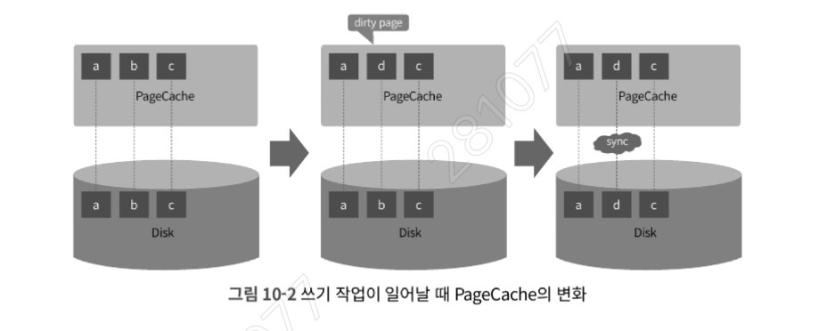
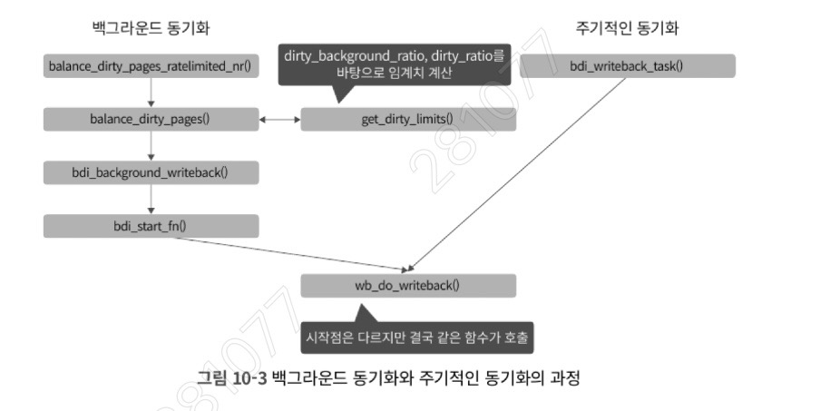

### 10.1 dirty page란: 메모리와 디스크의 불일치 영역

리눅스 커널은 디스크 I/O 성능 향상을 위해 **PageCache**를 사용한다. 
디스크의 내용을 메모리에 임시 저장하여 접근 속도를 높이는 방식이다.



- **발생 과정:** 파일 읽기 요청 시 커널은 PageCache를 먼저 확인하고, 내용이 없으면 디스크에서 읽어 PageCache에 저장한 뒤 사용자에게 전달한다. 반면 쓰기 작업이 발생하면 PageCache의 내용이 변경되지만, 이 내용이 즉시 디스크에 기록되지는 않는다.
    
- **Dirty Bit와 dirty page:** PageCache의 내용이 디스크의 실제 데이터와 달라진 상태를 커널은 **Dirty Bit**를 켜서 표시한다. 이렇게 디스크에 기록되지 않은 메모리 영역을 **dirty page**라고 부른다.
    
- **트레이드오프(Trade-off):** dirty page가 생성될 때마다 디스크에 쓰면 I/O 부하로 성능이 저하된다. 반대로 너무 늦게 쓰면 시스템 장애 시 메모리에만 있던 데이터가 사라져 데이터 정합성이 깨질 수 있다.
    

---

### 10.2 dirty page 관련 커널 파라미터: 동기화의 기준점

커널은 특정 조건이 만족되면 dirty page를 디스크로 옮기는 **page writeback(= dirty page 동기화)** 작업을 수행한다. 이 작업은 `pdflush`, `flush`, `bdi-flush` 등의 커널 스레드가 담당한다.

|**파라미터명**|**설명**|
|---|---|
|**vm.dirty_background_ratio**|전체 메모리 대비 dirty page의 비율(%)이 이 값에 도달하면 백그라운드에서 동기화를 시작한다.|
|**vm.dirty_background_bytes**|비율 대신 절대적인 용량(bytes) 기준으로 백그라운드 동기화를 시작한다.|
|**vm.dirty_ratio**|시스템의 전체 dirty page 비율이 이 값에 도달하면, I/O를 발생시키는 해당 프로세스를 멈추고 직접 동기화를 수행하게 한다. (Hard Limit)|
|**vm.dirty_bytes**|비율 대신 절대 용량 기준으로 프로세스의 쓰기 작업을 멈추고 동기화한다.|
|**vm.dirty_writeback_centisecs**|flush 커널 스레드를 깨우는 주기이다. 단위는 1/100초이며, 500 설정 시 5초마다 깨어난다.|
|**vm.dirty_expire_centisecs**|dirty page가 생성된 후 디스크로 기록되기까지 메모리에 머무를 수 있는 최대 시간이다.|

1. `dirty_background_ratio` vs `dirty_ratio` 의 차이
- `background_ratio`는 **커널 스레드**가 뒤에서 조용히 일하게 만드는 '부드러운 권장 사항'인 반면, `dirty_ratio`는 시스템 전체의 안전을 위해 **애플리케이션의 쓰기 작업을 강제로 중단**시키는 '강력한 규제'이다. 
- 만약 `dirty_ratio`에 도달하면 서비스 응답 시간이 갑자기 튀는(Spike) 현상이 발생하므로, 일반적으로 `background_ratio`를 낮게 설정하여 미리미리 디스크에 기록하게 유도하는 것이 서비스 안정성에 유리하다.

---

### 10.3 백그라운드 동기화: 내부 동작과 ftrace 추적

dirty page 동기화는 크게 세 가지 방식으로 구분된다.

1. **백그라운드 동기화:** `vm.dirty_background_ratio` 등의 설정값에 의해 보이지 않게 진행된다.
    
2. **주기적인 동기화:** `vm.dirty_writeback_centisecs` 주기에 따라 주기적으로 발생한다.
    
3. **명시적인 동기화:** 사용자가 `sync`, `fsync` 등의 명령어를 직접 호출한다.
	1. **sync:** 시스템 전체의 모든 dirty page를 디스크로 밀어낸다. 시스템 종료 전이나 중요한 설정 변경 후에 사용한다.
	2. **fsync:** 특정 파일 디스크립터(File Descriptor)에 대해서만 동기화를 보장한다. DB의 트랜잭션 로그 기록 등에서 데이터의 물리적 저장을 보장하기 위해 필수적으로 사용되는 시스템 콜이다.
    
#### ftrace를 이용한 동작 확인 

- 커널 파라미터를 조절하여 백그라운드 동기화가 일어나는 과정을 추적할 수 있다. 
- ```sh
	Dirty:             83100 kB
	Dirty:             84044 kB
	Dirty:             85068 kB
	Dirty:                72 kB
  ```
- 예를 들어, 테스트 프로그램 초당 1MB의 쓰기 작업 일으키도록 동작한 다음, 8GB 메모리 시스템에서 `vm.dirty_background_ratio`를 1로 설정하면 dirty page가 약 80MB 쌓였을 때 동기화가 시작됨을 확인 할 수 있다.
- ```
		io_test-8834 [001] 13986.088241: balance_dirty_pages_ratelimited_nr <-generic_file_buffered_write
		io_test-8834 [001] 13987.099072: balance_dirty_pages_ratelimited_nr <-generic_file_buffered_write
		io_test-8834 [001] 13987.110242: writeback_in_progress <-balance_dirty_pages
		io_test-8834 [001] 13987.113094: balance_dirty_pages_ratelimited_nr <-generic_file_buffered_write
		io_test-8834 [001] 13987.113110: balance_dirty_pages_ratelimited_nr <-generic_file_buffered_write
		io_test-8834 [001] 13987.113127: balance_dirty_pages_ratelimited_nr <-generic_file_buffered_write
  ```
- 커널 함수들이 호출되는 흐름을 추적한 결과
- balance_dirty_pages_ratelimited_nr 함수가 호출된 후 중간 중간에 balance_dirty_pages() 함수가 호출되는 패턴이 특징
- 쓰기 작업이 발생할 때마다 매번 시스템 전체의 dirty page를 계산하면 부하가 크기 때문에, `ratelimit`이라는 임계치를 두어 일정량 이상의 페이지가 쌓였을 때만 실제 검사 함수인 `balance_dirty_pages()`를 호출하기 때문

#### 커널 소스 코드 분석 



- **balance_dirty_pages_ratelimited_nr():** 쓰기 작업이 일어날 때마다 호출되는 함수이다. 매번 시스템의 모든 dirty page를 검사하면 오버헤드가 크기 때문에 `ratelimit` 변수를 사용하여 일정 수준 이상의 쓰기가 발생했을 때만 실제 검사를 진행한다. 
    
- **ratelimit_pages:** 초기 비교 대상이 되는 값으로, `writeback_set_ratelimit()` 함수를 통해 CPU 수와 메모리 크기에 따라 결정된다. 
	- ```
		void writeback_set_ratelimit(void)
		{
		    ratelimit_pages = vm_total_pages / (num_online_cpus() * 32);
		    if (ratelimit_pages < 16)
		        ratelimit_pages = 16;
		    if (ratelimit_pages * PAGE_CACHE_SIZE > 4096 * 1024) // ❶
		        ratelimit_pages = (4096 * 1024) / PAGE_CACHE_SIZE; // ❷
		}
	  ```
	- PAGE_CACHE_SIZE 은 page의 크기와 동일한 4KB 이기 때문에 ratelimit_pages값이 1024가 되면, 즉 CPU마다 4MB 쓰기 작업이 일어날때마다 balance_dirty_pages() 함수가 호출된다.
	- CPU마다 일정량(약 4MB 정도)의 쓰기 작업이 쌓일 때까지는 못 본 척 기다려주자
    
- **balance_dirty_pages():** 실제 dirty page의 크기를 확인하고 임계치(thresh)와 비교하여 동기화가 필요한지 결정하는 핵심 함수이다. `get_dirty_limits()`를 통해 현재 시스템의 제한값을 가져와 비교 연산을 수행한다. 

- `get_dirty_limits()`: 해당 함수는 설정된 커널 파라미터를 기반으로 백그라운드 동기화와 하드 리미트(Hard Limit)가 발생할 dirty page의 수를 계산한다
	- 만약 dirty page 생성 속도가 백그라운드 동기화로 비우는 속도보다 빠를 경우, 커널은 `io_schedule_timeout()`을 호출하여 해당 프로세스의 쓰기 동작을 강제로 멈춘다. 이는 시스템의 전체적인 성능 저하를 일으키는 주된 요인이 된다.
	- ```c
		void get_dirty_limits(unsigned long *pbackground, unsigned long *pdirty, unsigned long *pbdi_dirty, struct backing_dev_info *bdi)
		{
		    unsigned long background;
		    unsigned long dirty;
		    unsigned long available_memory = determine_dirtyable_memory();
		    struct task_struct *tsk;
		    int dirty_ratio = 0;
		
		    // 1. vm.dirty_bytes 설정 확인 및 페이지 단위 변환
		    if (vm_dirty_bytes) ❶
		        dirty = DIV_ROUND_UP(vm_dirty_bytes, PAGE_SIZE);
		    else {
		        dirty_ratio = vm_dirty_ratio;
		        // 2. vm.dirty_ratio가 5보다 작으면 5로 강제 설정 (방어 로직)
		        if (dirty_ratio < 5) ❷
		            dirty_ratio = 5;
		        // 3. 비율을 바탕으로 실제 페이지 수 계산
		        dirty = (dirty_ratio * available_memory) / 100; ❸
		    }
		
		    // 4. vm.dirty_background_bytes 설정 확인 및 변환
		    if (dirty_background_bytes) ❶
		        background = DIV_ROUND_UP(dirty_background_bytes, PAGE_SIZE);
		    else
		        background = (dirty_background_ratio * available_memory) / 100;
		
		    // 5. 백그라운드 임계치가 전체 임계치보다 크거나 같을 경우 재설정
		    if (background >= dirty) ❹
		        background = dirty / 2;
		
		    // ... (중략) ...
		    
		    *pbackground = background;
		    *pdirty = dirty;
		}
	  ```
    
- **커널의 방어 로직:**
    
    - **우선순위:** `vm.dirty_bytes`나 `vm.dirty_background_bytes` 값이 설정되어 있다면, 비율 기반인 `ratio` 설정은 무시된다. 두 방식은 동시에 적용될 수 없다.
        
    - **최소값 보장:** `vm.dirty_ratio`는 최소 5% 미만으로 내려가지 않도록 설계되어 있다. 이는 너무 작은 값으로 인해 프로세스가 빈번하게 멈추는 것을 방지하기 위한 일종의 안전장치이다.
        
    - **논리적 정합성:** 만약 사용자가 실수로 `background_ratio`를 `dirty_ratio`보다 크게 설정하더라도, 커널 내부에서 `background` 값을 `dirty / 2`로 강제 재설정하여 논리적 모순을 해결한다
        
- **Flush 커널 스레드의 기상:**
    
    - dirty page가 임계치를 넘으면 `bdi_start_background_writeback()` 함수가 호출된다.
        
    - 이 함수는 `wb_writeback_work` 구조체를 생성하여 작업 큐에 넣고, `wake_up_process()`를 통해 잠자고 있던 **flush 커널 스레드**를 깨운다.
        
    - 실제로 동기화를 수행하는 핵심 함수는 `wb_do_writeback()`이며, 이는 모든 동기화 방식의 공통 시작점이 된다.

- **주기적인 동기화 (Periodic Writeback):**
    ㅔ
    - 백그라운드 동기화 조건에 도달하지 않더라도, `vm.dirty_writeback_centisecs` 설정에 따라 커널 스레드가 주기적으로 깨어나 동기화를 시도한다.
        
    - `vm.dirty_expire_centisecs`는 dirty page의 '유통기한'을 의미하며, 이 시간이 지난 페이지들은 우선적으로 디스크에 기록된다.
	    - 이 파라미터는 성능보다는 **데이터 안전성**과 직결된다. 
	    - 값을 3000(30초)으로 설정하면, 시스템 장애 시 최대 30초 분량의 데이터가 사라질 수 있음을 의미한다. 
	    - 금융권이나 DB 서버처럼 데이터 유실이 절대 용납되지 않는 환경에서는 이 값을 기본값보다 낮게 설정하여 메모리 체류 시간을 강제로 줄이는 전략을 사용
        
    - `bdi_writeback_task()` 함수 내에서 `dirty_writeback_interval` 값이 0 이라면 아무것도 하지 않고 `schedule()` 함수를 호출하여 무한 대기 상태에 빠지므로, 파라미터 설정을 통해 주기적 동기화를 멈출 수 있음을 확인할 수 있다
        
- **동기화 과정의 통합:**
    
    - 백그라운드 동기화와 주기적인 동기화는 시작 지점과 트리거 조건이 다르지만, 결국은 모두 `wb_do_writeback()` 함수를 호출하여 실제 디스크 쓰기 작업을 수행한다.
---

### 10.4 dirty page 설정과 I/O 패턴: 실전 테스트

커널 파라미터 변경에 따라 시스템의 I/O 동작이 어떻게 변하는지 실험을 통해 확인할 수 있다.

- **테스트 환경 설정:**

    - 8GB 메모리 시스템을 기준으로 `vm.dirty_background_ratio`를 10으로 설정한다. 이는 전체 메모리의 10%인 약 **800MB**까지 dirty page가 쌓여야 동기화를 시작하도록 유도하는 설정이다.
        
    - `vm.dirty_ratio`는 20으로 설정하여, dirty page가 약 1.6GB에 도달할 경우 해당 프로세스의 쓰기 작업을 중단시키고 동기화하도록 강제한다.
        
    - `vm.dirty_expire_centisecs`를 3000(30초)으로 길게 설정하여, 주기적인 동기화 엔진이 테스트 도중 수시로 개입하는 것을 방지한다.
        
- **I/O 패턴 관찰 결과 
    
    - 1GB 파일을 생성하는 테스트 프로그램을 실행하면, Dirty page 수치가 임계치인 800MB에 도달할 때까지 계속해서 증가한다. (44kB → 124MB → 530MB → 797MB)
        
    - 임계치(800MB)를 넘어서는 순간 커널의 백그라운드 동기화 로직이 작동하며, 쌓여있던 데이터가 한꺼번에 디스크로 기록되면서 Dirty 수치가 급격히 떨어진다.

	- vm.dirty_background_ratio 값을 10 테스트한 다음, 1로 감소시켜 테스트해본다.
        
    - vm.dirty_background_ratio: 10
	    - 대부분 갑자기 I/O 사용량이 0에서 100에 이르는 패턴을 보인다.
	    - flush 커널 스레드가 깨어나는 조건이 더 길어지는 대신에 한번에 동기화 해야하는 양이 많기 때문이다.
	- vm.dirty_background_ratio: 1
		- flush 커널 스레드는 더 자주 깨어나지만, 한 번에 동기화해야 할 양이 적기 때문에 `io util(%)`의 최댓값이 첫 번째 테스트보다 낮아진다. (
    - **Delayed Write(지연 쓰기)** 에 의한 것으로, 평소에는 I/O 발생을 억제하다가 특정 시점에 폭발적인 I/O를 발생시키는 **Burst I/O** 형태를 띤다.
	    - **Burst I/O** : 짧은 시간 동안 대량의 데이터가 디스크로 쏟아지는 **현상**
	    - **Wait I/O**: CPU가 I/O 완료를 기다리며 아무것도 못 하고 있는 **상태**
        
- **동기화 주기의 트레이드오프 :**
    
    - **자주 깨울 때:** `io util(%)`은 비교적 낮게 유지되지만, flush 커널 스레드가 자주 깨어남에 따른 스케줄링 오버헤드가 발생한다. 특히 멀티 스레드 환경에서는 애플리케이션의 CPU 리소스를 빼앗아 성능 저하를 유발할 수 있다.
        
    - **늦게 깨울 때:** 스케줄링 오버헤드는 적지만 한 번에 써야 할 양이 많아져 `io util(%)`이 급격히 높아지는 단점이 있다.
        
    - 결론적으로 절대적인 기준은 없으며, 현재 시스템의 워크로드와 디스크 성능에 따라 최적의 값을 결정해야 한다.
        
- **디스크 성능에 따른 차별화 전략 :**
    
    - **저성능 디스크(System A, 10MB/s):** 한 번에 100MB씩 동기화하면 백그라운드 동기화 속도가 생성 속도를 따라잡지 못해 `dirty_ratio`에 도달하고 성능이 저하된다. 따라서 10MB 단위로 자주 동기화하는 것이 유리하다.
        
    - **고성능 디스크(System B, 100MB/s):** 굳이 10MB 수준에서 자주 깨울 필요가 없다. 100MB가 생성될 때까지 CPU를 충분히 사용한 후 한 번에 동기화하는 것이 전체적인 성능 측면에서 더 효율적이다.

#### I/O Burst와 I/O Wait

- **Burst I/O** : 짧은 시간 동안 대량의 데이터가 디스크로 쏟아지는 **현상**
- **Wait I/O**: CPU가 I/O 완료를 기다리며 아무것도 못 하고 있는 **상태
- 테스트에서  "0%에서 갑자기 100%에 이르는 패턴"이 바로 **I/O Burst**이다. 
- 이 Burst가 발생하는 동안 디스크는 다른 요청을 처리하기 어려워지며, 이때 CPU가 I/O 완료를 기다리게 되는 지표가 **I/O Wait**이다. 
- 고성능 NVMe SSD를 사용하는 환경이라면 Burst가 금방 끝나 Wait 수치가 낮겠지만, 네트워크 스토리지(EBS 등) 환경이라면 Burst가 길어지며 시스템 전체가 멈춘 듯한(Hang) 현상을 겪을 수 있다.

---
### 10.5 요약

1. **vm.dirty_ratio의 최소값은 5이다.** 5보다 작은 값으로 해도 강제로 5로 재설정된다.
    
2. **vm.dirty_background_ratio가 vm.dirty_ratio보다 크다면** 강제로 vm.dirty_ratio의 절반 값으로 수정된다.
    
3. **vm.dirty_background_bytes, vm.dirty_bytes 값이 설정되어 있다면** 각각 vm.dirty_background_ratio, vm.dirty_ratio 값은 무시된다.
    
4. **vm.dirty_writeback_centisecs가 0이면** 주기적인 동기화를 실행하지 않는다.
    
5. **vm.dirty_ratio에 설정한 값 이상으로 dirty page가 생성되면** 성능 저하가 발생한다.
    
6. **dirty page를 너무 빨리 동기화시키면** flush 커널 스레드가 너무 자주 깨어나게 되며, **dirty page를 너무 늦게 동기화시키면** 동기화해야 할 dirty page가 너무 많아서 vm.dirty_ratio에 도달할 가능성이 커지게 된다. 따라서 워크로드와 시스템 구성에 맞게 dirty page 동기화 수준을 설정해 주어야 한다.
    

---