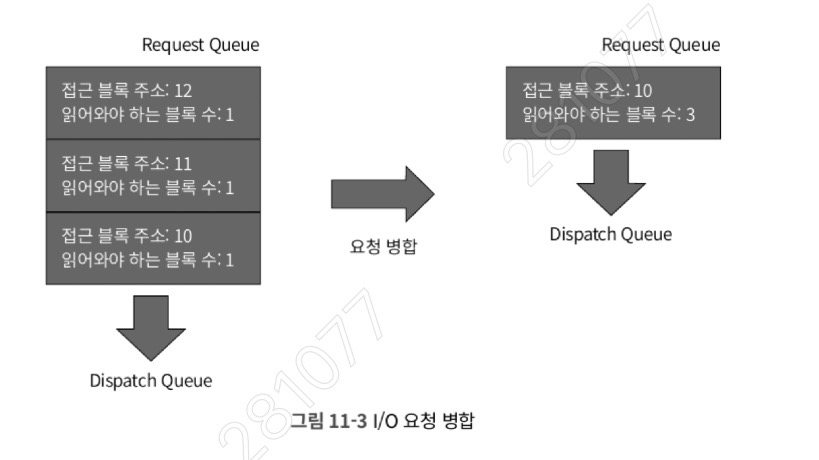
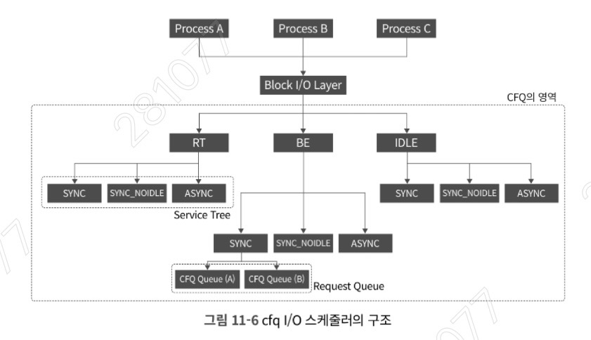
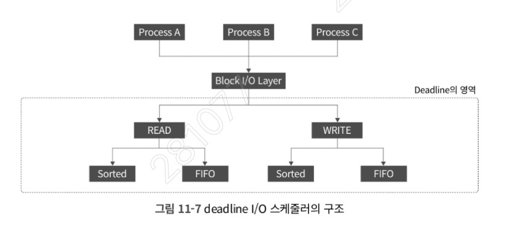

## I/O 작업이 지나가는 관문, I/O 스케줄러

- 읽기, 쓰기와 같은 I/O 작업은 가상 파일 시스템(VFS), 로컬 파일 시스템 등을 거쳐 블록 디바이스로 전달되기 전 커널의 일부인 **I/O 스케줄러**를 거치게 된다. 
- 디스크는 상대적으로 접근 속도가 느리기 때문에, I/O 스케줄러는 성능을 극대화하기 위해 '병합(Merging)'과 '정렬(Sorting)'이라는 방식을 사용한다. 
- 워크로드에 맞지 않는 스케줄러를 사용하면 오히려 성능이 저하될 수 있다.

### I/O 스케줄러의 필요성


디스크는 물리적 구조에 따라 HDD와 SSD로 나뉘며, 이 구조적 차이가 I/O 스케줄러의 동작 방식에 큰 영향을 미친다.

- **HDD (Hard Disk Drive):** 디스크 헤드와 플래터(원판) 등 기계식 부품으로 이루어져 있다.
    
    - 데이터를 읽고 쓰기 위해 디스크 헤드가 플래터의 특정 위치로 물리적으로 이동해야 한다.
        
    - 이동에 많은 시간이 소요(Seek time)되므로, 헤드의 움직임을 최소화하고 한 번 움직일 때 최대한 많이 처리해야 I/O 성능이 극대화된다.
        
- **SSD (Solid State Drive):** 기계식 부품(헤드, 플래터) 없이 기판에 장착된 플래시 메모리를 기반으로 데이터를 처리한다.

	- 플래시 메모리: 전원이 꺼져도 데이터가 사라지지 않는 비휘발성 반도체 저장장치로, 전기적으로 데이터를 자유롭게 재기록 가능
    
    - 컨트롤러를 통해 전기적 신호로 접근하므로, 헤드의 위치와 상관없이 임의의 특정 섹터에 접근할 때 소요되는 시간이 모두 동일하다.
        

이러한 물리적 한계를 극복하고 성능을 높이기 위해 커널은 두 가지 최적화 기법을 사용한다.

**1) 병합 (Merging)**

- 

- 인접한 주소에 대한 여러 개의 I/O 요청을 하나의 큰 요청으로 합치는 작업이다. 
    
- 예를 들어 10번, 11번, 12번 블록을 각각 1개씩 읽어오는 3개의 요청이 큐에 들어올 경우, 이를 하나로 묶어 10번 블록부터 3개 블록만큼 한 번에 읽어오도록 지시한다.
    
- 이를 통해 디스크로 전달되는 명령 횟수를 최소화하여 성능을 향상시킨다.
    

**2) 정렬 (Sorting)** : 여러 개의 요청을 헤드의 이동 경로가 최적화되도록 섹터 순서대로 재배치하는 작업이다. 

- 정렬 전: 1 -> 7 -> 3 -> 10 순서로 요청을 처리하면 헤드가 앞뒤로 움직이며 총 17만큼의 불필요한 이동 비용이 발생한다.
    
- 정렬 후: 1 -> 3 -> 7 -> 10 순서로 재배치하면 헤드가 순방향으로만 움직여 총 9만큼의 이동만 발생한다.
    
- **주의점:** 나중에 들어온 요청이 순서상 앞서 있다면 먼저 처리되므로, 먼저 발생한 요청이 늦게 처리되는 기아(Starvation) 현상이 생길 수 있다. I/O 스케줄러는 다양한 알고리즘으로 이를 해결한다.
    
- **SSD와 정렬:** SSD는 헤드가 없어 이동 비용이 발생하지 않으므로 정렬이 무의미하다. 오히려 정렬하는 데 불필요한 CPU 리소스가 소모되어 성능이 나빠질 수 있으므로, SSD는 HDD와 다른 방식의 스케줄러 설정이 필요하다.

### I/O 스케줄러 설정

현재 시스템에 적용된 I/O 스케줄러를 확인하고 튜닝하는 방법이다.

- **스케줄러 확인** 
    
    - `cat /sys/block/<장치명>/queue/scheduler` 명령을 통해 확인한다.
    - 
        
    - 책 예시 출력 결과(예: `noop [deadline] cfq`)에서 대괄호 `[ ]`로 감싸진 부분이 현재 설정된 스케줄러이다.
        
- **스케줄러 변경:**
    
    - `echo cfq > ./scheduler` 와 같이 echo 명령어를 사용하여 동적으로 변경할 수 있다.
        
- **파라미터 변경:**
    
    - 스케줄러를 변경하면 해당 큐의 하위 디렉터리인 `iosched` 디렉터리의 파라미터 파일들이 스케줄러에 맞게 즉시 변경된다.
        
    - 예를 들어 cfq일 때는 튜닝 가능한 파라미터가 12개 존재하지만, deadline으로 바꾸면 5개로 줄어든다. 이 파라미터 값을 조정하여 특정 워크로드에 최적화할 수 있다.

#### aws ec2 환경과의 비교

```
HDD:  [앱1] [앱2] [앱3] → OS 스케줄러가 순서 조정 → 디바이스 (큐 1개)
NVMe: [앱1] → 큐1 ┐
      [앱2] → 큐2 ├→ 디바이스가 직접 병렬 처리 (최대 65535개 큐)
      [앱3] → 큐3 ┘
```

- 책에서 설명하는 CFQ, Deadline과 같은 전통적인 스케줄러는 **단일 큐(Single-Queue)** 아키텍처를 기반으로 설계
  
- 과거 HDD 시대에는 디스크 자체가 느렸기 때문에 커널에서 1개의 큐를 두고 정렬과 병합 알고리즘을 빡빡하게 돌려도 CPU가 충분히 감당할 수 있었다. 
  
- 하지만, 초당 수백만 번의 I/O를 처리하는 NVMe 기반의 초고속 SSD가 등장하면서 상황이 역전되었고 디스크는 엄청나게 빠른데, 커널의 I/O 큐가 1개뿐이라 수많은 CPU 코어가 이 큐에 접근하기 위해 락(Lock) 경합을 벌이게 되었고, 스케줄러 자체가 거대한 병목 구간(Bottleneck)이 되어버림
  
- **커널의 구조적 변화 (blk-mq):** 
	- 이 문제를 해결하기 위해 리눅스 커널(3.13 이후, 완전 기본화는 5.x)은 **Multi-Queue Block I/O (blk-mq)** 프레임워크를 도입했다. 
	- 소프트웨어 큐를 여러 CPU 코어별로 매핑하여 락(Lock) 없이 I/O 요청을 병렬로 하드웨어 디스패치 큐에 내려보내는 방식이다.
    
- **실무적 적용의 의미:**
    
    - **CFQ의 퇴장:** CentOS 8(RHEL 8)이나 Ubuntu 20.04 이상의 최신 운영체제에서는 전통적인 CFQ, Deadline 스케줄러 코드가 아예 삭제되었다.
        
    - **현대적인 대체재:**
        
        1. `bfq` (Budget Fair Queueing): CFQ의 복잡한 논리를 멀티 큐 환경에 맞게 개선한 현대판 공정 스케줄러. HDD나 느린 장치에 적합.
            
        2. `mq-deadline`: 지연 시간 보장이 중요한 일반적인 SATA SSD 환경에서 기본적으로 사용됨 (HDD는 헤드 이동 최소화가 핵심인 반면 SSD는 헤드 없음, 기아 방지가 핵심)
	        - SATA는 원래 HDD용으로 설계된 AHCI 프로토콜을 그대로 사용 → SSD 성능 다 못 씀
	        - NVMe는 SSD의 병렬 처리 특성에 맞게 처음부터 새로 설계된 프로토콜
	        - ```
		          SATA SSD: CPU → SATA 컨트롤러 → SATA 인터페이스 → SSD
		          NVMe SSD: CPU → PCIe 버스 → SSD (직접 연결)
	          ```
	        - NVMe는 중간 단계가 없어서 레이턴시가 훨씬 낮음.

        3. `none`: 가장 중요한 설정. 
	        - NVMe SSD 환경에서는 병합과 정렬 알고리즘 자체가 오버헤드. 
	        - 스케줄러의 개입을 완전히 배제하고 CPU에서 디바이스로 I/O를 직행시키는 `none`이 압도적으로 유리하며, NVMe 장착 시 기본값으로 설정된다
            
    - 즉, 책의 내용으로 **병합과 정렬, 그리고 I/O Fairness의 기초 원리**를 완벽히 이해하되, 실무 서버를 튜닝할 때는 스토리지의 하드웨어 스펙(SATA SSD vs NVMe)에 따라 `none`이나 `mq-deadline`을 선택하는 것이 현재 시스템 엔지니어링의 표준

#### 스케줄러 종류

| 책 (커널 4.x 이하) | aws ec2(t3.medium) (커널 5.x+) | 적합한 환경    | 특징                           |
| ------------- | ---------------------------- | --------- | ---------------------------- |
| noop          | none                         | NVMe, EBS | 순서 재배열 없음, 하드웨어가 직접 처리(none) |
| deadline      | mq-deadline                  | SATA SSD  | 요청 만료시간 기반, 기아 방지            |
| cfq           | bfq                          | HDD       | 헤드 이동 최소화 + 공평한 대역폭 분배       |
| (없음)          | kyber                        | 고성능 NVMe  | 레이턴시 목표 기반                   |

현재 EC2가 none인 이유
- NVMe(EBS)는 하드웨어 자체가 수만 개의 큐를 병렬 처리할 수 있어서 OS 스케줄러가 개입할 필요가 없기 때문
- OS 스케줄러를 끼우면 오히려 오버헤드 발생 → none 사용.

EC2 인스턴스
└── /dev/nvme0n1 (NVMe 인터페이스로 보임)
        ↓ 실제로는 네트워크
    AWS 스토리지 서버 (EBS 볼륨)

- EBS는 NVMe 인터페이스로 접근하는 원격 네트워크 스토리지
- OS에서는 똑같이 /dev/nvme0n1으로 보이지만 실제로는 다름
- AWS가 Nitro 시스템 도입 이후 EBS를 NVMe 인터페이스로 노출시키도록 변경.
- 그래서 OS 입장에서는 NVMe 디바이스처럼 보이지만, 실제 데이터는 네트워크를 통해 별도 서버에 위치한 NVMe SSD에 저장
  
```
로컬 NVMe:  EC2 → PCIe → SSD (직접)
EBS:       EC2 → 네트워크 → AWS 스토리지 서버 → (내부 SSD)
```

|           | 로컬 NVMe (인스턴스 스토어)        | EBS        |
| --------- | ------------------------- | ---------- |
| 레이턴시      | ~20µs                     | ~100~200µs |
| 인스턴스 종료 시 | 데이터 사라짐                   | 데이터 유지     |
| 용량 변경     | 불가                        | 가능         |
| 사용 인스턴스   | i3, i4i 등 (스토리지 최적화 인스턴스) | 일반 EC2 전체  |

---

### cfq I/O 스케줄러

cfq는 **Completely Fair Queueing**의 약자로, 모든 프로세스가 발생시키는 I/O 요청을 공정하게 처리하는 것이 목적인 스케줄러이다. 

**1) 구조 및 우선순위 분배**

- 
- **Priority:** I/O 특성에 따라 RT(Real Time), BE(Best Effort), IDLE 세 가지로 우선순위를 정의하며, 기본적으로 대부분의 I/O는 BE에 속한다. (`ionice` 명령어로 변경 가능)
	- RT 에 속한 요청들을 가장 먼저 처리하고 IDLE에 속한 요청들을 가장 나중에 처리한다.
    
- **Service Tree (워크로드 그룹화):** 우선순위 분류 후, 워크로드 성격에 따라 다음 세 가지로 다시 큐를 나눈다.
    
    - **SYNC:** 동기화 I/O (주로 순차 읽기). 
	    - 처리 완료 후 약간의 시간 동안 다음 I/O를 대기(Idle)한다. 
	    - 가까운 섹터의 I/O가 들어오면 헤드 이동 없이 처리하여 성능을 높이기 위함이다.
        
    - **SYNC_NOIDLE:** 임의(Random) 동기화 I/O (주로 임의 읽기). 
	    - 헤드가 많이 움직이는 작업이므로 다음 요청을 굳이 기다려도 성능상 이점이 없기 때문에 대기하지 않는다(NOIDLE).
        
    - **ASYNC:** 비동기화 I/O (주로 쓰기 작업). 
	    - 각 프로세스에서 발생한 쓰기 작업을 ASYNC 트리 밑 하나의 큐에 모아놓고 한꺼번에 처리한다.
        
- **Time Slice:** 프로세스별로 할당된 cfq 큐에 요청을 넣고, 각 큐에 동등한 타임 슬라이스(Time slice)를 부여하여 순차적으로 처리한다. 모든 프로세스에 공정한 기회를 주지만, 특정 프로세스가 빠른 I/O 처리를 원할 때 자신의 차례를 기다려야 하므로 성능이 저하될 가능성도 있다.
    

**2) 주요 튜닝 파라미터** : cfq 스케줄러를 튜닝할 수 있는 12개의 값 중 책에 소개된 주요 설정

- `back_seek_max`: 디스크 헤드의 현재 위치를 기준으로 역방향 탐색(Backward seeking)을 허용하는 최대 거리이다. 이 기준 안의 요청은 바로 다음 요청으로 간주되어 헤더 움직임을 최소화하지만, 다른 요청이 밀릴 수 있다. 순차 쓰기가 주를 이루는 시스템에서는 값을 줄이는 것이 좋다.
	- 현재 위치가 10이고, back_seek_max값이 5라면 5부터 9까지 들어온 요청은 다음 요청으로 처리
    
- `back_seek_penalty`: 역방향 탐색에 대한 페널티 비율을 정의한다. 디스크 헤드는 순서대로(1->2->3) 움직이는 것이 성능에 좋으므로, 역방향 이동 거리에 이 페널티 값을 곱하여 거리를 인위적으로 멀게 인식시킨다. 즉, 역방향 이동을 지양하고 순방향 이동을 선호하게 만든다.
    
- `fifo_expire_async`: 비동기 요청(주로 쓰기)의 만료 시간이다. 대부분의 쓰기 작업은 커널의 Page Cache에 쓰는 Dirty Page 작업으로 끝나므로 애플리케이션을 블로킹하지 않고 비동기적으로 완료된다.
    
- `fifo_expire_sync`: 동기 요청(주로 읽기)의 만료 시간이다. 애플리케이션이 파일의 내용을 읽을 때, 데이터가 메모리에 적재될 때까지 앱이 블로킹된다. 이러한 동기적 I/O 요청에 대한 만료(Starvation 방지용) 시간을 정의한다.
    
    
- **`group_isolation`**: cgroup 간의 I/O 격리 수준을 결정한다. (0 또는 1)
    
    - **기본값(0)**: 임의 접근(Random Access) 특성상 헤드 이동이 많은 `SYNC_NOIDLE` 큐들을 성능 향상을 위해 루트 cgroup에 모아 한 번에 처리한다.
        
    - **적용 시(1)**: 루트로 모으지 않고 각 cgroup별로 엄격하게 I/O를 분리하여 처리한다. 격리는 명확해지지만 전체적인 성능은 낮아질 수 있다.
      
	    - cgroup(Control Group):
		    - 단일 프로세스 단위가 아니라, 여러 프로세스를 하나의 '그룹'으로 묶어서 자원(CPU, 메모리, I/O 등) 사용량을 제한하고 격리하는 리눅스 커널의 기능이다. (참고로 도커 컨테이너가 이 기술을 기반으로 자원을 격리한다.)
	    - CFQ 스케줄러는 단순히 프로세스별로 큐를 나누는 것을 넘어, cgroup 단위로도 대기열을 관리하고 I/O 처리 시간을 분배할 수 있다는 것.
        
- **`low_latency`**: I/O 대기 시간을 줄이는 기능의 활성화 여부이다. (0 또는 1)
    
    - 활성화 시(1), 각 큐에 time_slice를 할당하기 전에 처리해야 할 전체 그룹의 예상 소요 시간을 계산한다. 이 값이 소스 코드에 하드 코딩된 `target_latency`(300ms)를 넘지 않도록 각 큐의 time_slice를 동적으로 조절하여 기아(Starvation) 현상을 방지한다.
        
- **`slice_idle`**: 큐 처리를 완료한 후 다음 큐로 넘어가기 전 대기하는 시간이다. (단위: ms)
    
    - 보통 순차 접근(Sequential Access) 시 다음 I/O 요청이 곧바로 들어올 확률이 높으므로, 헤드 이동을 최소화하기 위해 잠시 대기한다. 최근 커널에서는 기본값이 0으로 설정된다.
        
- **`slice_sync`**: 동기(Sync/Read) 요청을 처리하는 큐에 할당되는 기준 time_slice 값이다.
    
- **`slice_async`**: 비동기(Async/Write) 요청을 처리하는 큐에 할당되는 기준 time_slice 값이다.
    
- **`slice_async_rq`**: 큐에서 한 번에 꺼내서 Dispatch Queue로 넘기는 비동기 요청의 최대 개수이다.
    
- **`quantum`**: 큐에서 한 번에 꺼내서 Dispatch Queue로 넘기는 동기 요청의 최대 개수이다. 이 값이 커지면 한 번에 많은 요청을 처리하지만, 다른 큐의 대기 시간이 길어져 성능이 저하될 수 있다.
	- cfq Queue: 스케줄러의 대기실 (I/O 스케줄러가 직접 통제하고 관리하는 **소프트웨어 대기열**)
		- 프로세스별로 나뉘어 있으며, 스케줄러는 이 안에서 요청들을 병합(Merge)하고 섹터 순서대로 정렬(Sort)하는 작업을 수행
		- 즉, 아직 디스크로 갈 준비를 하며 스케줄러의 허락(Time slice)을 기다리는 공간
	- Dispatch Queue: 디스크로 가는 출발 선
		- 스케줄러의 처리가 끝나고, 실제 디스크 장치(블록 디바이스 드라이버)로 전달되기 직전의 요청들이 모이는 **최종 하드웨어 전달용 큐** 
		- 디스패치 큐에 들어간 요청은 스케줄러의 통제권을 벗어난다. 더 이상 순서가 바뀌지 않으며, 들어간 순서대로 디스크 하드웨어에 명령이 전달된다.


### deadline I/O 스케줄러

deadline 스케줄러는 이름 그대로 I/O 요청별로 완료되어야 하는 '기한(deadline)'을 부여하고, 가능한 한 이 시간을 넘기지 않도록 동작하는 스케줄러이다. 

**1) 구조 및 동작 원리**



- 총 4개의 큐(List)를 유지한다: 
	- 읽기/쓰기 각각에 대해 **Sorted list(섹터 기준 정렬)** 와 **FIFO list(시간 기준 정렬)** 를 가진다.
    
- 평상시에는 섹터 기준으로 정렬된 Sorted list에서 요청을 꺼내 처리하여 디스크 헤드의 움직임을 최소화한다.
    
- 처리 도중 FIFO list를 확인하여 설정된 deadline을 넘긴 요청이 발견되면, 즉시 헤드를 이동하여 해당 요청(FIFO list)을 우선 처리한다. 그 후 처리된 섹터 위치를 기준으로 Sorted list를 재정렬하여 이후 작업을 이어나간다.
    

**2) 주요 튜닝 파라미터**

- **`fifo_batch`**: 한 번에 Dispatch queue로 전달하여 실행할 I/O 요청(Batch)의 개수이다. (기본값: 16개)
    
- **`front_merges`**: 섹터 번호가 역방향(앞쪽)으로 발생하는 요청에 대한 병합 탐색 여부이다. 일반적인 로그 쓰기 등은 순방향으로 섹터가 증가하므로, 순차 작업 위주의 시스템에서는 이 값을 0으로 설정하면 불필요한 탐색을 줄여 성능을 약간 향상시킬 수 있다. (기본값: 1)
    
- **`read_expire`**: 읽기 요청에 대한 deadline 한계 시간이다. (기본값: 500ms)
    
- **`write_expire`**: 쓰기 요청에 대한 deadline 한계 시간이다. (기본값: 5000ms)
	- 쓰기 작업은 커널이 데이터를 디스크에 바로 쓰지 않고, 메모리(Page Cache)의 일부분에 데이터를 저장한 다음, 실제 디스크로의 기록은 나중에 백그라운드 프로세스(flusher)가 알아서 처리한다. `write_expire`가 5000ms(5초)로 더 넉넉하게 설정되어 있는 이유
    
- **`writes_starved`**: deadline 스케줄러는 기본적으로 읽기 처리를 선호(읽기는 메모리에 없다면 무조건 디스크에서 물리적으로 읽어와야되기 때문에 지연되면 애플리케이션이 block 된다. 따라서 더 짧은 expire 설정)하므로, 쓰기 요청이 계속 지연되는 것을 막기 위한 밸런스 설정 값이다. (기본값: 2)
    
    - 의미: 읽기 배치를 2번 처리할 때 쓰기 배치를 1번 처리한다는 뜻이다. 이 값을 1로 변경하고 두 expire 값을 동일하게 맞추면 읽기와 쓰기를 동등하게 처리할 수 있다.
        

### noop I/O 스케줄러

noop 스케줄러는 가장 단순한 형태의 스케줄러로, **병합(Merging) 작업만 수행하고 정렬(Sorting)은 하지 않는다.**

- **존재 이유:** 헤드를 물리적으로 움직여야 하는 기계식 HDD와 달리, 플래시 메모리 기반의 **SSD는 특정 섹터에 도달하는 접근 시간이 모두 동일**하다.
    
- 따라서 SSD 환경에서는 굳이 CPU 리소스를 낭비해가며 섹터를 정렬할 필요가 없으므로, 정렬을 생략하는 noop 스케줄러의 사용이 강력히 권장된다. 튜닝 가능한 파라미터도 존재하지 않는다.

### cfq vs deadline 스케줄러 요약

다중 프로세스 환경에서는 스케줄러의 처리 기준(프로세스 vs 시간/섹터)에 따라 성능 차이가 확연히 드러난다.

- **cfq (프로세스 공정성 중심)**
    
    - **핵심:** 프로세스 단위로 공평하게 I/O 기회를 분배한다. (순차 처리 위주)
        
    - **효과:** 특정 사용자의 요청만 지연되거나 빨리 처리되는 불균형을 방지한다.
        
    - **적합 환경:** 다수의 프로세스가 비슷한 양의 I/O를 발생시키는 **웹 서버, 미디어 스트리밍 서버**
        
- **deadline (전체 처리량 중심)**
    
    - **핵심:** 프로세스 소속을 무시하고, I/O 발생 시간(기한)과 디스크의 물리적 섹터 위치만을 기준으로 가장 효율적인 경로를 짠다. (임의 접근 위주)
        
    - **효과:** 프로세스별로 큐를 대기하는 낭비 시간(idle)을 없애 전체 I/O 처리량을 극대화한다.
        
    - **적합 환경:** 소수의 프로세스가 압도적으로 많은 I/O를 발생시키는 **DB 서버, 파일 서버** 

###  I/O 워크로드 살펴보기

시스템에 가장 효과적인 I/O 스케줄러를 적용하려면, 현재 시스템에서 어떤 형태의 I/O 워크로드가 발생하고 있는지 정확히 파악해야 한다.

**1) 프로세스 확인: `iotop`**

```
sudo iotop -b -n 1 -P

Total DISK READ:   0.00 B/s | Total DISK WRITE:   0.00 B/s
Current DISK READ: 927.32 K/s | Current DISK WRITE:  0.00 B/s

PID   PRIO  USER     DISK READ  DISK WRITE  COMMAND
1     be/4  root     0.00 B/s   0.00 B/s   systemd
2604  be/4  root     0.00 B/s   0.00 B/s   amazon-ssm-agent
...

```

iotop 출력 항목 설명

| 항목                      | 설명                                          |
| ----------------------- | ------------------------------------------- |
| Total DISK READ/WRITE   | 전체 누적 IO                                    |
| Current DISK READ/WRITE | 현재 순간 IO 속도                                 |
| PID                     | 프로세스 ID                                     |
| PRIO                    | IO 우선순위 (be=best-effort, rt=realtime, idle) |
| /4                      | 우선순위 레벨 (0~7, 낮을수록 높은 우선순위)                 |
| DISK READ/WRITE         | 해당 프로세스의 IO 속도                              |
| SWAPIN                  | 스왑 사용 비율                                    |
| IO                      | IO 대기 시간 비율                                 |

테스트환경 EC2는 IO가 거의 없는 유휴 상태, Current DISK READ: 927 KB/s는 iotop 설치(yum) 과정에서 발생

- 얼마나 많은 프로세스가 I/O를 일으키는지 확인할 수 있는 대표적인 명령어이다. 
	- cfq 스케줄러는 스레드가 아닌 프로세스별로 큐를 할당하므로 `-P` 옵션을 붙여서 사용하는 것이 좋다.

**2) I/O 패턴 확인 (순차 vs 임의): `iosnoop`** : 발생 중인 I/O가 순차 접근(Sequential)인지 임의 접근(Random)인지 파악하는 것은 일반 명령어로 어렵다.

- GitHub에 공개된 Brendan Gregg의 `perf-tools` 오픈소스 중 **`iosnoop`** 툴을 사용하면 이를 추적할 수 있다.


### 요약

모든 워크로드를 다 만족시키는 절대적인 I/O 스케줄러는 존재하지 않는다. 각 스케줄러의 특징과 시스템의 I/O 워크로드를 파악하여 가장 적합한 것을 찾아야 한다.

1. **스케줄러 확인 및 변경:** `/sys/block/<block device>/queue/scheduler` 파일에서 현재 설정과 사용 가능한 목록을 확인하며, `echo` 명령으로 변경한다.
    
2. **cfq I/O 스케줄러:** 프로세스별로 큐를 할당하고 타임 슬라이스 동안 처리한다. 공정성은 좋으나 큐 이동 시 시간이 소요되고, 임의 접근이 많을 경우 성능 저하가 발생할 수 있다.
    
3. **deadline I/O 스케줄러:** 섹터 기준 정렬과 I/O 발생 시간(기한)을 함께 관리한다. 특정 요청이 지연되면 큐 중간이라도 해당 요청을 강제 처리한다. I/O 집중도가 높은 DB/파일 서버에 적합하다.
    
4. **noop I/O 스케줄러:** 정렬 없이 병합 작업만 진행한다. 물리적인 디스크 헤드 이동이 없는 SSD(플래시 메모리) 디바이스에 가장 적합한 스케줄러이다.
    
5. **워크로드 분석 도구:**
    
    - `iotop -P`: 현재 시스템에서 I/O를 일으키는 프로세스의 수와 주체를 파악한다.
        
    - `perf-tools (iosnoop)`: 발생하는 I/O 요청들의 섹터 주소(`BLOCK`)를 추적하여 순차/임의 접근 패턴을 파악한다.