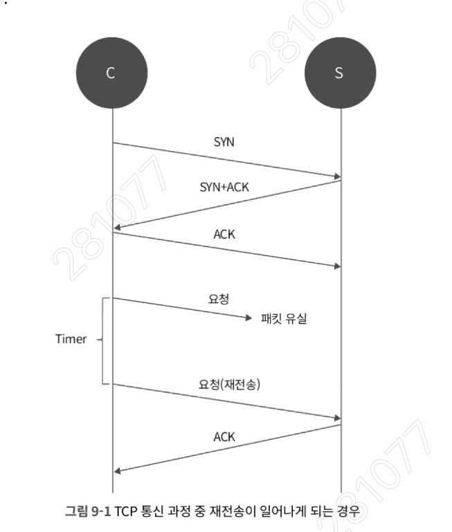
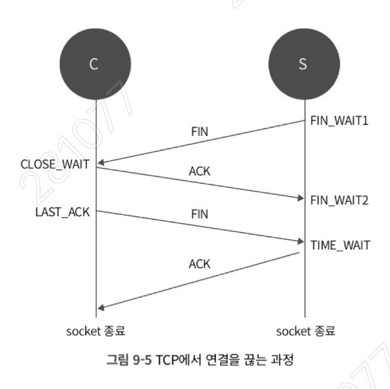
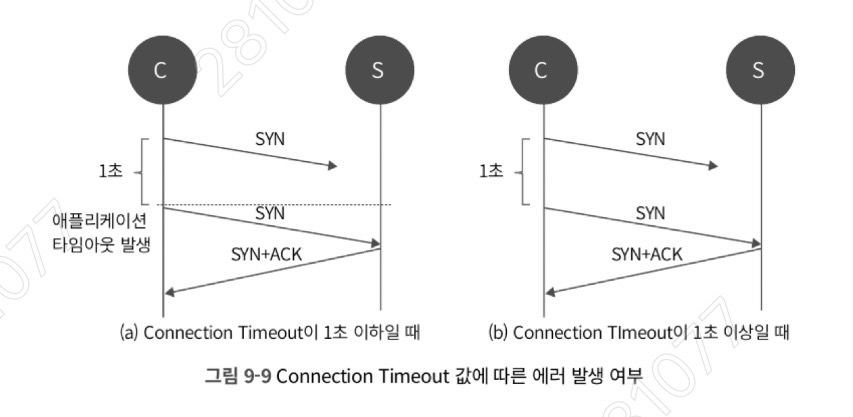

## 9.1. TCP 재전송과 RTO: 통신 신뢰성의 핵심 메커니즘

TCP는 송신한 데이터에 대해 상대방으로부터 응답 패킷(ACK)을 받아야 통신이 정상적으로 완료되었다고 판단하는 **신뢰성 있는 연결**을 지향한다. 
만약 정해진 시간 내에 ACK를 받지 못하면 패킷 유실로 간주하고 데이터를 다시 보낸다.

- **TCP 재전송(Retransmission):** 패킷 유실 시 동일한 패킷을 다시 보내는 과정이다. 
	- 네트워크 성능 저하를 야기할 수 있으나, 데이터의 정확한 전달을 위해 필수적인 과정이다.
    
- **RTO (Retransmission Timeout):** 패킷을 보낸 후 ACK를 기다리는 제한 시간을 의미한다. RTO 이내에 ACK가 오지 않으면 재전송이 시작된다.
    
- **RTO의 종류:**
    
    - **일반적인 RTO:** 두 종단 간의 **RTT(Round Trip Time)** 를 기반으로 설정된다. 
	    - 예를 들어 RTT가 1초라면 RTO는 최소 1초 이상이어야 불필요한 재전송을 막을 수 있다.
        
    - **InitRTO:** 최초 연결 시작(TCP 3-Way Handshake) 시에는 RTT를 알 수 없으므로 임의의 초기값을 사용한다. 
	    - 리눅스 커널 소스에서는 기본적으로 **1초**로 구현되어 있다.
        
- **RTO 확인 방법:** `ss -i` 명령어를 통해 세션별 설정된 RTO 값을 확인할 수 있다. 
	- (`rto:214`는 214ms를 의미함)
	- ```sh
	  [root@server ~]# ss -i
		State      Recv-Q Send-Q      Local Address:Port          Peer Address:Port
		ESTAB      0      40          172.16.33.136:ssh           172.31.5.250:49888
		     cubic wscale:5,10 rto:214 rtt:14.875/1.5 ato:40 cwnd:10 send 7.2Mbps rcv_rtt:15 rcv_space:14480
	  ```
    
## RTO 계산 공식

TCP는 매번 패킷을 주고받을 때마다 **RTT(왕복 시간)** 를 측정하여 RTO를 동적으로 계산한다.
initRTO 제외하고는

$$RTO = SRTT(평균 RTT) + 4 \times RTTVAR(RTT 편차)$$

- **상황 A (내부망):** RTT가 1ms라면, 계산된 RTO는 5ms가 된다. 하지만 $RTO\_MIN$인 **200ms**에 걸려 실제로는 200ms로 동작한다.
- **상황 B (해외망/불안정한 망):** RTT가 500ms라면, RTO는 약 **600~800ms**가 된다. 이때는 $RTO\_MIN$(200ms)보다 크기 때문에 **계산된 값인 800ms가 실제 RTO**가 된다.
- 결론: RTT가 길어지면 초기 RTO 자체가 커지기 때문에, 여기서 시작하는 지수적 백오프($800ms \rightarrow 1.6s \rightarrow 3.2s \dots$)는 200ms에서 시작할 때보다 훨씬 빠르게 100초를 돌파하게 된다. 
	- RTT가 RTO 결정에 결정적인 영향을 미친다.
---

## 9.2. 재전송을 결정하는 커널 파라미터: 5가지 주요 설정

리눅스 커널은 무한정 재전송을 반복하지 않으며, 특정 커널 파라미터 값에 따라 재전송 횟수와 간격을 조절한다.

#### 1) net.ipv4.tcp_syn_retries



- **정의:** TCP 연결은 이미 성립된 세션뿐만 아니라, **연결을 시도하는 과정**에서도 재전송이 일어난다. 이 파라미터는 클라이언트 입장에서 서버에 연결을 요청하는 **SYN 패킷의 재시도 횟수**를 결정한다.
    
- **동작:** 기본값은 **5**이며, TCP 스펙에서도 이 값을 최소 5로 설정하도록 권고하고 있다.
	- 최초 1초(InitRTO)에서 시작하여 재전송마다 대기 시간이 **2배씩 증가(Exponential Backoff)** 한다. (1초 -> 2초 -> 4초 -> 8초 -> 16초...)
	- **전체 대기 시간:** 기본값이 5일 경우, 1+2+4+8+16 = **총 31초** 동안 응답을 기다린 후 연결 실패로 판단한다
    
- **실무적 의미:** 이 값을 줄이면 연결되지 않는 서버에 대한 타임아웃을 빠르게 발생시켜 애플리케이션의 응답성을 높일 수 있다.
	- 새로운 연결에 대한 타임아웃을 빠르게 설정하고 싶을 때 이 값을 줄인다.
        
    - 예를 들어 이 값을 **3**으로 줄이면, 약 7초(1+2+4) 정도만 기다리고 연결을 종료하므로 애플리케이션의 빠른 예외 처리가 가능하다.

#### 2) net.ipv4.tcp_synack_retries

- **정의:** 서버 입장에서 클라이언트의 SYN에 대한 응답으로 보내는 **SYN+ACK 패킷의 재전송 횟수**를 정의한다.
    
- **동작:** 기본값은 **5**이다. SYN을 받은 후 서버는 **SYN_RECV** 상태가 되는데, 정상적인 응답이 오지 않으면 재전송을 반복한다.
	- ```
	  1. 클라이언트: 서버로 SYN 송신
	  2. 서버: SYN을 받고 SYN_RECV 상태로 변경됨과 동시에 클라이언트로 SYN+ACK 송신
	  3. 클라이언트: 서버의 SYN+ACK를 받고 이에 대한 응답으로 ACK 송신 (이 ACK가 서버에 도착해야 연결이 ESTABLISHED가 된다.)
	  ```
	- 3번 단계의 **ACK 패킷**이 서버에 도착하지 않으면, 서버는 클라이언트가 자신의 SYN+ACK를 받지 못했다고 판단한다. 그래서 설정된 `tcp_synack_retries` 횟수만큼 **SYN+ACK를 다시 보낸다.**
    
- **SYN_RECV 상태 유지와 리소스 고갈의 원인:** 
	- **SYN Backlog 점유:** 서버가 SYN을 받아 `SYN_RECV` 상태가 되면, 커널은 이 연결 정보를 **SYN Backlog**라는 메모리 큐(Queue)에 보관한다.
		- **상태 유지 시간:** `tcp_synack_retries` 값이 기본값인 **5**라면, 서버는 약 31초(1+2+4+8+16) 동안 이 소켓을 `SYN_RECV` 상태로 유지하며 클라이언트의 마지막 ACK를 기다린다.
		- **리소스 고갈 (SYN Flood):** 공격자나 비정상적인 클라이언트가 수많은 SYN만 보내고 ACK를 보내지 않는다면, 서버의 SYN Backlog는 금방 가득 차게 된다.
		- **결과:** 큐가 가득 차면 서버는 더 이상 새로운 SYN 요청을 받을 수 없게 되어, 정상적인 사용자의 접속마저 차단되는 **서비스 거부** 상태에 빠지게 된다.
	- 따라서, 비정상적인 연결 요청(예: DDoS 공격)이 많을 경우 이 값이 크면 서버 리소스(Backlog Queue)가 고갈될 수 있으므로, 상황에 따라 적절히 줄여주는 것이 좋다.
    

#### 3) net.ipv4.tcp_orphan_retries : Orphan Socket 재전송 제어



- **Orphan Socket이란?** 특정 프로세스에 바인딩되지 않고 커널에 귀속된 소켓을 의미한다. 주로 연결을 끊는 과정에서 발생한다.
- **발생과정:** TCP 연결을 끊을 때 클라이언트가 `FIN` 패킷을 보내면 소켓 상태는 **FIN_WAIT1**이 된다.
	- 이때 애플리케이션(프로세스)은 이미 `close()`를 호출하여 소켓과의 연결을 해제한 상태라면
	- 결과적으로 이 소켓은 더 이상 프로세스의 소유가 아니며 커널 소유(Orphan)가 되며, `netstat`에서 PID가 보이지 않게 된다.

- **재전송 메커니즘:**
    
    - **FIN_WAIT1** 상태에서 보낸 FIN 패킷에 대한 ACK를 받지 못할 때 `tcp_orphan_retries` 값만큼 재전송한다. 
	    - Orphan Socket 상태에서도 데이터의 무결성을 위해 재전송이 일어난다.

	- **재전송 횟수 계산 (`tcp_orphan_retries()` 함수):**
	    - 사용자가 설정한 커널 파라미터 값을 가져오지만, 조건에 따라 이 값이 무시되기도 한다.
	    - 커널 소스 코드(`tcp_timer.c`)의 `tcp_orphan_retries()` 함수를 보면, 사용자가 파라미터 값을 0으로 설정하더라도 내부적으로 `alive` 값에 따라 재전송 횟수가 조정된다.
        
	    - **alive 로직:** 소켓의 현재 RTO 값이 `TCP_RTO_MAX`(120초)보다 작으면 `alive`는 **1(True)** 이 된다. 
		    - ```c
		      static int tcp_write_timeout(struct sock *sk)
			{
			    // ... (중략) ...
			    
			    // 소켓이 프로세스에 바인딩되지 않은 Orphan Socket 상태인지 확인
			    if (sock_flag(sk, SOCK_DEAD)) {
			        // ❶번이 alive를 결정하는 부분: RTO가 최대치(120초)보다 작으면 1(True)이 됨
			        const int alive = (icsk->icsk_rto < TCP_RTO_MAX); ❶
			        retry_until = tcp_orphan_retries(sk, alive);
			    }
			    
			    // ... (후략) ...
			}
			```
        
	    - **강제 재설정 (8회의 법칙):** 파라미터 설정을 **0**으로 하더라도, 소켓이 `alive` 상태라면 커널은 내부적으로 재전송 횟수를 **8회**로 변경하여 반환한다. (코드 9-7 ❶번 조건문)
		    - ```c
	      /* Calculate maximal number or retries on an orphaned socket. */
			static int tcp_orphan_retries(struct sock *sk, int alive)
			{
			    int retries = sysctl_tcp_orphan_retries; /* May be zero. */
			
			    /* We know from an ICMP that something is wrong. */
			    if (sk->sk_err_soft && !alive)
			        retries = 0;
			
			    /* However, if socket sent something recently, select some safe
			     * number of retries. 8 corresponds to >100 seconds with minimal
			     * RTO of 200msec. */
			    if (retries == 0 && alive) ❶
			        retries = 8;
			    return retries;
			}
		      ```
        
	- **설계 의도:** 
		- 이는 소켓이 네트워크의 일시적인 문제로 인해 너무 급격히 닫히는 것을 방지하기 위함이다. 
		- 8회 재전송은 최소 RTO 200ms 기준 지수적 백오프를 적용했을 때 약 **100초 이상**의 시간을 확보해준다.

#### 설정값에 따른 실제 동작의 차이

- **설정값 0:** 로직에 의해 **8회** 재전송이 발생한다.
    
- **설정값 1:** 와이어샤크 덤프 확인 결과, 실제로는 **2번**의 재전송이 일어난다. 즉, 커널은 설정한 값보다 보통 **1번 더** 재전송을 시도하는 경향이 있다.
    
- **상태 변화:** `FIN_WAIT1` 상태에서 지정된 재전송 횟수를 모두 채울 때까지 `ACK`를 받지 못하면, 커널은 해당 소켓을 비정상적이라고 판단하여 `FIN_WAIT2`나 `TIME_WAIT`로 넘기지 않고 **즉시 강제 회수(정리)** 한다.

- **권장 사항:** 너무 낮은 값은 FIN 패킷 유실 시 소켓이 정상적으로 정리되지 않는 문제를 야기한다. 
	- 최소한 **TIME_WAIT** 상태가 유지될 수 있도록 **7 정도**의 값을 유지하는 것이 권장된다.
		- **`tcp_fin_timeout` (60초):** `FIN_WAIT2` 상태에서 상대방의 FIN을 기다리는 최대 시간이다. 리눅스 커널의 기본 설정값은 60초이며, 이 시간이 지나면 커널은 상대방의 `FIN`이 오지 않더라도 소켓을 강제로 파괴한다.
			- **표준(Standard)이라 불리는 이유:** TCP 규약(RFC) 상의 **MSL(Maximum Segment Lifetime)** 이 보통 30초~2분 사이로 권장되는데, 리눅스는 이를 **60초**로 구현했다. 따라서 리눅스 시스템에서 "연결 종료 대기 시간은 보통 1분(60초)이다"라는 인식이 생겼고, 이것이 다른 파라미터(예: `tcp_orphan_retries`)의 설계 기준이 됐다.
		- 파라미터 간의 시간적 동기화 (60초 ~ 120초)
		- 
		- 재전송을 7회 수행하면 지수적 백오프에 의해 총 대기 시간이 **60초(표준 대기 시간)** 를 넘기게 된다. 이는 소켓이 `FIN_WAIT1`에서 허무하게 사라지지 않고 최종 목적인 **`TIME_WAIT`** 에 도달할 확률을 높여준다. 
		- 120초의 상한선:**`TCP_RTO_MAX` 값은 또 120초이기 때문에 60초 ~ 120 초 사이의 값으로 적절한 횟수인 7회를 권장
    

#### 4) net.ipv4.tcp_retries1 & tcp_retries2 : 데이터 전송 중의 임계치

**연결이 이미 성립된(ESTABLISHED) 상태에서 데이터를 주고받을 때** 발생하는 재전송을 관리하는 파라미터이다.
TCP는 데이터를 보내고 ACK를 받지 못할 때 무작정 연결을 끊지 않는다. 단계별로 대응하기 위해 두 가지 임계치(Threshold)를 사용한다.

- **tcp_retries1 (Soft Threshold):** 재전송이 발생했을 때, **"네트워크 경로에 문제가 있는 것 같으니 확인해봐"** 라고 IP 레이어(네트워크 계층)에 신호를 보내는 기준이다.
	- 설정된 횟수(기본값 보통 3회)만큼 재전송이 일어나면, 커널은 내부적으로 라우팅 테이블을 다시 확인하거나 경로 재설정(Routing Re-evaluation)을 시도한다.
	- 이 단계에서는 **연결을 끊지 않는다.** 단지 문제를 인지하고 복구를 시도하는 '부드러운(Soft)' 경고 단계이다.
    
- **tcp_retries2 (Hard Threshold):** 재전송이 계속되어 **"이제는 정말 통신이 불가능하다"**라고 판단하여 연결을 강제로 끊는 최종 기준이다.
	- 설정된 횟수(기본값 보통 15회)를 넘기면 TCP는 재전송을 중단하고 소켓을 닫는다. 이때 애플리케이션에는 `ETIMEDOUT` 에러가 반환된다.
	- 실제 서비스의 가용성에 직접적인 영향을 주는 '딱딱한(Hard)' 차단 단계이다.

|**구분**|**tcp_retries1**|**tcp_retries2**|
|---|---|---|
|**별칭**|Soft Threshold|Hard Threshold|
|**기본값**|3 (환경에 따라 다를 수 있음)|15|
|**주요 역할**|IP 레이어에 경로 확인 요청|TCP 연결 강제 종료 및 에러 반환|
|**연결 상태**|유지됨 (복구 시도 중)|**종료됨**|

---

## 9.3. 재전송 추적하기: tcpretrans

TCP 재전송 여부를 파악하는 가장 효과적인 방법은 **tcpretrans** 스크립트를 사용하는 것이다.

- **동작 원리:** 1초에 한 번씩 깨어나 ftrace를 통해 수집된 커널 함수 정보를 바탕으로 재전송 발생 여부를 파악하고, `/proc/net/tcp`를 파싱하여 해당 세션 정보를 출력한다. 
	- ```perl
	  while (1) {
		    sleep $interval;
		    # buffer trace data
		    open TPIPE, "trace" or die "ERROR: opening trace_pipe.";
		    my @trace = ();
		    while (<TPIPE>) {
		        next if /^#/;
		        push @trace, $_;
		    }
		    close TPIPE;
		}
	  ```
    
- **모니터링 정밀도 향상:** 기본 인터벌이 1초이므로 트래픽이 많은 서버에서는 재전송 패킷을 놓칠 수 있다. 더 정확한 추적이 필요하다면 `interval` 값을 **200ms(0.2)** 정도로 수정하여 실행하는 것이 좋다.
	- ```perl
		my $tracing = "/sys/kernel/debug/tracing";
		my $flock = "/var/tmp/.ftrace-lock";
		my $interval = 0.2; # 기존 1에서 0.2로 수정
		local $SIG{INT} = \&cleanup;
		local $SIG{QUIT} = \&cleanup;
	  ```
    

---

## 9.4. RTO_MIN 값 변경하기: 빠른 재전송을 위한 튜닝

리눅스 커널에서 RTO의 최솟값(`TCP_RTO_MIN`)은 **200ms**로 하드코딩되어 있다.

- **한계:** 내부 망 통신처럼 RTT가 매우 짧은(예: 1ms 미만) 환경에서도 최소 200ms를 기다려야 재전송이 발생하므로 응답 속도가 저하될 수 있다.
    
- **해결 방법 (ip route):** 전체 시스템 설정은 바꿀 수 없지만, `ip route` 명령의 `rto_min` 옵션을 통해 라우팅 단위로 최솟값을 변경할 수 있다.
    
    - **명령어:** `ip route change default via <GW> dev <Device> rto_min 100ms`
        
- **효과:** `ss -i` 명령으로 확인 시 `rto` 값이 설정한 100ms 수준으로 내려가며, 패킷 유실 시 더 빠르게 재전송을 시도하여 서비스 품질을 높일 수 있다. 
	- ```sh
	  [root@server ~]# ip route change default via 10.10.10.1 dev eth0 rto_min 100ms
	  ```
    

---

## 9.5. 애플리케이션 타임아웃: Connection vs Read

TCP 재전송 메커니즘은 애플리케이션의 타임아웃 설정과 밀접한 연관이 있다.



|**종류**|**발생 경로**|**최소 권장 설정값**|**이유**|
|---|---|---|---|
|**Connection Timeout**|TCP Handshake 과정|**3s 이상**|InitRTO(1s) 기반 재전송 1회(1s) + 2회(2s) 소요 고려|
|**Read Timeout**|데이터 요청/응답 과정|**300ms 이상**|RTO_MIN(200ms) 기반 재전송 1회 이상 커버 목적|

- **Connection Timeout 설정 전략:** 첫 SYN 패킷에 대한 재전송은 1초 후, 그다음은 2초 후에 일어난다. 따라서 최소 **3초**로 설정해야 두 번의 재전송 기회를 가질 수 있다. (그림 9-9 참조)
    
- **Read Timeout 설정 전략:** 이미 연결된 세션에서는 RTO가 RTT 기반으로 계산되지만 최소 200ms(`RTO_MIN`)는 보장된다. 따라서 재전송 1회 정도를 견디려면 최소 **300ms** 이상으로 설정하는 것이 안전하다.
    

---

## 9.6. 요약

1. TCP 재전송은 RTO를 기준으로 발생하며, 응답이 없으면 지수적으로 대기 시간이 늘어난다.
    
2. `InitRTO`는 리눅스에서 기본 1초이며, Handshake 과정에서 적용된다.
    
3. `tcp_orphan_retries`는 0으로 설정해도 커널 로직상 최소 8회(alive 시) 재전송을 시도한다.
    
4. `tcp_retries2`에 도달했을 때 비로소 실제 연결이 종료된다.
    
5. `tcpretrans` 도구와 `ip route`의 `rto_min` 옵션을 활용해 재전송을 감시하고 최적화할 수 있다.
    
6. **애플리케이션 타임아웃은 반드시 커널의 재전송 주기를 고려하여 Connection 3초, Read 300ms 이상으로 설정할 것을 권장한다.**
    

---

**1. 지수적 백오프 (Exponential Backoff)의 이유** TCP 재전송 간격이 2배씩 늘어나는 이유는 네트워크 혼잡(Congestion)을 제어하기 위해서이다. 패킷이 유실되었다는 것은 현재 네트워크 경로에 부하가 걸렸을 가능성이 높다는 신호이다. 이때 즉시 재전송을 반복하면 혼잡을 가중시키므로, 대기 시간을 늘려 네트워크가 회복될 시간을 벌어주는 전략을 취한다.

**2. Application Timeout vs Kernel Retransmission** 실무에서 가장 흔한 실수는 애플리케이션의 타임아웃 설정을 커널의 재전송 시간보다 짧게 잡는 것이다.

- 예: 커널은 5번 재전송하며 총 31초를 기다리도록 설정되어 있는데, 애플리케이션 타임아웃이 3초라면, 커널이 재전송을 시도하는 도중에 애플리케이션이 연결을 끊어버려 정확한 에러 원인을 파악하기 어렵게 된다. 따라서 두 값의 밸런스를 맞추는 것이 중요하다.
    

**3. SYN_RECV 상태와 보안** `tcp_synack_retries` 파라미터는 보안 관점에서 중요하다. **SYN Flooding** 공격 시 서버는 수많은 SYN_RECV 상태 소켓을 생성한다. 재전송 횟수를 과도하게 높게 설정하면 서버가 유령 연결을 유지하기 위해 메모리와 CPU를 계속 소모하게 되므로, 고가용성 서비스에서는 이를 낮추고 `tcp_syncookies` 설정을 검토해야 한다.


**1. RTO_MIN 튜닝 시 주의사항**

`rto_min`을 너무 낮게 설정(예: 10ms)하면 네트워크의 일시적인 지연(Jitter)조차 패킷 유실로 오판하여 불필요한 재전송을 남발하게 된다. 이는 오히려 네트워크 대역폭을 낭비하고 혼잡을 유발할 수 있다. 따라서 내부망 인프라의 평균 RTT와 편차(RTTVAR)를 충분히 모니터링한 후 결정해야 한다.

**2. Orphan Socket과 시스템 리소스**

`tcp_orphan_retries`를 적절히 유지해야 하는 또 다른 이유는 메모리 때문이다. 프로세스가 종료되었음에도 커널에 남겨진 Orphan Socket들이 재전송을 포기하지 않고 너무 오래 남아있으면, `tcp_mem` 임계치에 도달하여 새로운 연결을 맺지 못하는 상황이 발생할 수 있다. 장애 상황에서는 이 소켓들의 상태를 `ss -s`로 주기적으로 확인해야 한다.
