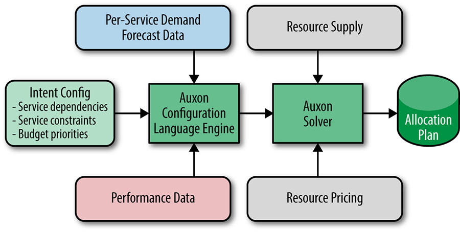

# Software Engineering in SRE

- Google의 소프트웨어 엔지니어링 중 많은 비중을 차지하는 제품이 무엇이냐하면 -> Gmail, Maps 같은 사용자 서비스라고 답할 것이다.
- 하지만 상당 부분은 사용자에게 드러나지 않은 SRE 조직에서 개발한 소프트웨어이다.
- ex) 롤아웃 배포 메커니즘, 모니터링, 동적 서버 구성 기반 개발 환경
- 하나의 독립된 소프트웨어 엔지니어링 프로젝트이다.
- 소프트웨어 개발자와 동일한 마음가짐으로 로드맵에 기초하여 업무 수행한다.
---

## Why Is Software Engineering Within SRE Important?
SRE 조직의 소프트웨어 엔지니어링 역량이 중요한 이유

Google의 대규모 프로덕션 환경은 외부 도구로는 충족되지 않으며, SRE 내에서 자체적으로 소프트웨어를 개발할 필요성이 존재한다.
- **SRE가 소프트웨어 개발에 적합한 이유**
	- Google의 프로덕션 환경에 대한 폭넓고 깊은 지식 덕분에 확장성이나 장애 발생시 대응 능력 및 다른 도구와의 호환성을 고려한 소프트웨어 설계 가능.
	- 사용자(다른 SRE들) 와의 직접적이고 신속한 피드백을 얻을 수 있다.
	- 내부 사용자 대상으로 빠른 출시와 반복 작업 가능, 초기 UI나 소프트웨어 문제에 대해 더 관대하다
	- SRE 가이드 원리: "팀의 규모는 서비스의 성장률과 직접적으로 비례하면 안된다."  
	  -> 폭발적으로 성장하는 서비스에도 불구하고 SRE 조직 규모를 선형적으로 유지하기 위해서는   
	  -> 자동화와 효율성 향상을 위해 지속적인 소프트웨어 개발 필요  
	- 프로덕션 시스템 운영 경험을 가진 엔지니어가 개발하면 가동 시간과 지연 목표를 효과적으로 달성 가능하다.
	- SRE 직업 만족도를 높여준다 - 코딩 스킬 유지
	- 소프트웨어 개발 경험을 가진 엔지니어 + 시스템 엔지니어링 경험을 가진 엔지니어 혼합한 팀을 유지

---

## Auxon Case Study: Project Background and Problem Space
Auxon 사례 연구: 프로젝트 배경 및 문제가 발생한 부분

Auxon는 SRE가 구글 프로덕션 환경에서 실행되는 서비스의 수용량 계획(capacity planning)을 자동화하기 위해 만든 소프트웨어이다.
### Traditional Capacity Planning 전통적인 수용량 계획

1. 수요 예측의 수집  
   - 자원이 얼마나 필요한가? 언제, 어디에 필요한가?
   - 현재 가용한 최선의 데이터를 확보해야 미래에 대한 계획을 수립 할 수 있다.
   - 몇 분기에서 몇 년에 이르는 데이터 기반으로 자료 수집

2. 빌드 및 할당 계획의 수립
   - 예측된 수요를 충족하기 위해 자원을 어디에 얼마나 배치해야 하는가

3.  리뷰 및 계획의 승인 
   - 예측된 수요는 적절한가?
   - 예산 범위를 초과 하지 않으며 기술적 고려 사항이 모두 고려됐는가.

4. 배포 및 자원 설정  
   - 자원이 도착하면 어떤 서비스가 이를 사용할지, 자원을 어떻게 적절하게 활용할 것인가.

-> 계속해서 게획이 수정될 수 밖에 없다.
계획 변경이 연쇄적으로 영향을 미쳐 시간과 노력을 소모하여 수작업이 진행된다.

#### Brittle by nature 본질적으로 불안하다.

- 서비스 효율성 저하로 더 많은 자원을 필요로 하는 경우
- 예상보다 높은 수요 증가
- 자원 배송 지연 등의 변화
- 제품의 성능 목표가 변경되어 서비스의 배포의 양 변경

작은 변화에도 확인을 위해 전체 할당 계획을 재점검 해야한다.
계획 변경이 연쇄적으로 영향을 미쳐 시간과 노력을 소모하게 한다.

#### Laborious and imprecise 노동집약적이며 모호하다

- 수요 예측 데이터 수집이 느리고 오류를 범하기 쉽다.
- 자원 할당이 수작업으로 이루어져 복잡하고 번거롭다.
- 스프레드 시트에 수작업을 진행시, 도구(예: 스프레드시트)의 신뢰성과 확장성이 부족하며 제한적인 기능만 제공한다.

즉, 서비스 담당자들이 일련의 수용량 요청을 계속 감당하려고 하면 할 수록 불확실한 요소들을 계속해서 증가한다.
(비유)
- 상자 채우기 문제 (bin packing problem)은 인간이 직접 계산하기에는 무척 어려운 NP-hard 문제이다.
- 수작업으로 처리하기 어렵다.
- 서비스 요구사항( X 코어 Y 클러스터) 의 유연성이 부족하다. 결국 사람이 하기에는 엄청난 노력이 필요하다.

### Our Solution: Intent-Based Capacity Planning 
구글의 해결책: 의도 기반 수용량 계획

- 의도기반 수용량 계획 접근법을 활용
- 기본적인 전제: 의존성과 서비스의 요구 사항(의도)를 프로그래밍 방식으로 인코딩하여 할당 계획 자동 생성하는 것.
- 수요, 공급, 서비스 요구 사항 변경에 따라 변경된 매개변수를 바탕으로 새로운 계획 자동 생성된다
- 결국 상자 채우기 문제를 컴퓨터에 위임함으로써, 인력 낭비 감소, 최적화된 자원 배치를 통해 비용 절감
- 서비스 담당자의 수작업을 줄이고 고급 우선순위(SLO, 서비스 의존성 등)에 집중 가능해졌다.

## Intent-Based Capacity Planning
의도 기반 수용량 계획

intent 의도 란?  
서비스 담당자가 자신들의 서비스를 운영하고자 하는 의도를 의미한다.

의도 기반 수용량 계획를 도출하기 위해 여러 단계의 **추상화**가 필요하다
    
1. 구체적 자원 요청: "Foo 서비스를 위해 클러스터 X, Y, Z에 50 코어 필요합니다."
2. 약간의 자유도 포함: "Foo 서비스를 위해 YYY 지역의 3개 클러스터에 50코어 필요합니다."
3. 유연성 도입: "Foo 서비스에 대한 각 지역별 수요를 충당하기를 원하며 N+2의 다중화를 원합니다."
   -> 자유도 매우 증가
4. 추상적 요구 및 더 유연적: "Foo 서비스에 99.999% 가용성 지원하고 싶습니다."
   -> N+2 다중화만으로 서비스 최적화 못할 수도 있으므로 다른 배포 계획 세울 수 있다.

- 결국 의도 기반 수용량 계획을 위해서는 어느 정도 수준의 의도가 반영되어야 할것인가?
- Google의 경험에 따르면 3단계 추상화를 제공할때 가장 큰성과를 냄
- 정교한 서비스는 4단계

### Precursors to Intent 의도를 파악하기 위한 선행 작업

- **의존성(Dependencies)**:
    - 의존성은 서비스의 위치를 결정하는 데 큰 영향을 미친다
    - ex) 서비스 Foo가 인프라 서비스 Bar에 의존하며, Bar는 30ms 이내에 있어야 함
    - 의존성이 중첩된 경우(예: Bar가 Baz와 Qux에 의존) 이를 모두 고려해야 함

- **성능 지표(Performance Metrics)**:
	- 의존성만이 아닌 조금더 자세한 정보가 필요한데 이는 성능 지표다 - 의존성과 성능지표의 연관성
    - ex) 서비스 Foo가 사용자 쿼리 N을 처리하려면 몇 개의 컴퓨팅 자원이 필요한가?
    - Foo 서비스에 N개의 요청이 전달되면 Bar 서비스는 몇 Mbps의 데이터를 서비스해야 할까?
    - 성능지표 확보를 위해 모니터링 필요

- **우선순위 결정 (Prioritization)**:
    - 자원 제한 상황에서 요구사항 간의 trade-offs를 투명하게 설정가능
    - 예: Foo의 N+2 다중화는 Bar의 N+1 다중화보다 더 중요시

---
### Introduction to Auxon

- Auxon은 Google의 의도 기반 용량 계획 및 자원 할당 솔루션으로
- SRE가 설계하고 개발한 대표적인 소프트웨어 엔지니어링 제품 사례
- SRE의 몇몇 소프트웨어 엔지니어와 기술 프로그램 관리자에 의해 2년에 걸쳐 개발되었으며, SRE 환경에서 소프트웨어 개발 권장을 보여주는 완벽한 사례이다.

- **활용 사례**
    - Google 내 여러 주요 부문에서 수백만 달러에 달하는 머신들을 사용하기 위한 계획 수립에 사용
    - 서비스의 자원 요구사항 및 의존성에 대한 의도 기반 명세를 수집하고, 이를 서비스 담당자가 서비스에 공급되기를 원하는 "요구사항"으로 표현한다.
    - Auxon의 우선순위를 결정하는 기능은 모든 요구사항을 충족시킬 수 없을때 유용
    - 요구사항(intent 의도)는 내부적으로 큰 혼합 정수(mixed integer) 또는 선형(linear) 프로그램으로 표현된다.

Auxon의 주요 컴포넌트

- **성능 데이터 (Performance Data)**:
    - 서비스의 규모를 의미
    - ex) 클러스터 Y에서 단위 수요 X당 필요한 의존성 Z의 수요 단위는 몇개일까.
    - 부하 테스트 또는 과거 성능 데이터를 통해 규모를 추측
- **서비스별 수요 예측 데이터 (Per-Service Demand Forecast Data)**:
    - 서비스 사용량 및 수요 신호를 예측
    - ex) 수요 예측, 초당 쿼리 수에 대한 예상치를 토대로 미래 사용량 예측
    - ex) 서비스는 자신에게 의존하는 다른 서비스를 바탕으로 수요 예측
- **자원 공급 (Resource Supply)**:
    - 기초 자원의 가용성 데이터 제공
    - 예: 특정 시점에 사용할 수 있는 머신 수
    - 자원 공급은 의도 기반 명세로 활용하는 것이 좋다.
- **자원 가격 (Resource Pricing)**:
    - 기초 자원의 비용 데이터
- **의도 설정 (Intent Config)**:
    - 의도 기반 정보를 Auxon에 전달하기 위한 핵심
    - 서비스 구성 그리고 어떻게 다른 서비스들과 관련되어있는지 표현
- **Auxon 설정 언어 엔진 (Auxon Configuration Language Engine)**:
    - 의도 설정 데이터를 바탕으로 Auxon solver가 이해할 수 있도록 머신이 읽을 수 있는 요청으로 공식화한다. 
    - 설정에 대한 안정성 검사를 수행하며, Auxon Solver로 최적화된 요청 전달.
- **Auxon Solver**:
	- 뇌에 해당
	- Auxon Configuration Language Engine 로 부터 받은 요청을 바탕으로 혼합 정수/선형 프로그램을 생성하고 실행
    - 수백~수천 대의 머신에서 병렬 실행 가능
- **할당 계획 (Allocation Plan)**:
	- 출력결과
    - 어떤 자원을 어떤 서비스에 할당할지 구체적으로 명시
    - 충족되지 않은 요구사항도 포함

---

### Requirements and Implementation: Successes and Lessons Learned
요구사항과 실제 구현: 성공 사례와 그로부터 배운 것들

- Auxon은 Google의 인프라 용량 계획을 담당하던 SRE와 기술 프로그램 관리자가 수작업 용량 계획의 비효율성을 해결하고자 구상 
- SRE는 Auxon의 사용자이자 개발자로서역할을 모두 소화해냈다. 
#### Approximation 
미완성된 제품 

- 문제의 한계가 명확하지 않은 경우 완벽한 해결책보다는 "시작 후 반복(Launch and Iterate)" 접근법이 중요하다
- 초기 단계에서는 단순화된 해결책 "Stupid Solver"를 도입
    - 간단한 휴리스틱(감, 직관)을 사용하여 사용자가 명시한 요구사항을 기반으로 서비스를 배치
    - 최적의 솔루션은 아니었지만 Auxon의 비전 실현의 가능성을 보여줌.

- 이후 Solver 인터페이스를 언제든 교체 가능하도록 설계하여 향후 개선을 쉽게 구현했다.
- **불명확한 요구사항**
    - 요구사항의 불확실성을 소프트웨어 설계의 유연성과 모듈화로 해결
    - ex) 다양한 자동화 시스템과 통합할 수 있는 '범용적인 접근법' 으로 디자인하여 각 시스템을 원하는 지점에서 통합할 수 있도록 구성
    - 미래 데이터가 부족할 경우, 머신 데이터를 단일 인터페이스로 노출함으로써 사용자들이 향후 각기 다른 모델을 쉽게 교체할 수 있도록 지원
    - 단일 인터페이스를 제공하여 사용자가 향후 다양한 머신 성능 모델을 손쉽게 교체할 수 있도록 했다. 
      - 모듈성 확장하여, 간단한 모델링 라이브러리 제공

---

### Raising Awareness and Driving Adoption 인식의 제고 및 도입의 촉진

- SRE가 개발한 소프트웨어는 사용자와 요구사항에 대한 깊은 이해를 바탕으로 설계되어야 한다.
- Google의 프로덕션 안정성 목표를 지원하고, SRE 작업을 개선하는 데 중점을 두어야 한다.
- 홍보 중요하다.
    - 단순한 발표나 이메일만으로는 충분하지 않음
    - 제품을 조직 전체에 효과적으로 확산시키기 위해서는
	    - 일관적이고 긴밀한 접근
	    - 사용자에 대한 지원
	    - 선임 개발자와 관리자의 전폭적인 지원
	- 이 필요하다.
#### Set expectations 기대치 설정하기

- 이상적인 목표와 최소 성공 기준(MVP)을 구분하는 것은 중요하다
- 초기 목표는 달성 가능하고 명확해야 하며, 작은 업데이트를 통해 점진적으로 개선해야한다.
- ex) Auxon은 초기에는 수작업 단기 자원 요청을 줄이는 데 중점을 두고, 이후 장기적 비용 절감 효과를 제공함
#### Identify appropriate customers 적절한 사용자층을 정의하기

- 초기 버전은 기존 도구가 없는 팀을 대상으로 한다.
- 초기 성공 사례를 통해 다른 팀의 도입을 유도한다.
#### Customer service 

- 초기 사용자를 위한 개별 지원 제공한다.
- 자동화로 인한 작업 우려를 해결하도록
- 초기 사용자의 긍정적 피드백이 다른 사람들의 관심을 갖게한다.
#### Designing at the right level 적절한 수준의 디자인

- **불가지론?(Agnosticism)**:
	- Auxon 디자인 원칙 중 핵심으로, 고객들이 Auxon을 사용하기 위해 어느 한 도구에 얽매일 필요가 없다
	- 소프트웨어를 일반화하여 다양한 데이터 소스를 입력으로 받을 수 있도록 설계 - 범용적
    - 메시지: "있는 그대로 오세요. 우리가 맞춰드리겠습니다."
    - 모든 팀에 적합한 도구보다는 주요 서비스에 적합한 도구 제공에 초점 맞춘다

---

### Team Dynamics 팀의 원동력

- 새로운 주제에 빠르게 적응할 수 있는 제너럴리스트와, 폭넓은 지식과 경험을 가진 전문가를 조합하여 초기 팀을 만드는 것이 큰 도움이 된다 -> 시드(seed)팀
    - 다양한 배경을 가진 팀원은 **blind spots(맹점)** 을 줄이고, 모든 팀의 활용 사례가 동일하다고 가정하는 위험을 방지해준다.
- 팀이 필요한 전문가와 협력 관계를 맺고, 엔지니어들이 새로운 문제를 당면해도 작업할 수 있는 환경을 조성하는 것이 중요하다.
    - 대부분의 회사에서는 외부 작업을 아웃소싱하거나 컨설턴트를 활용해야 하지만, 대규모 조직은 사내 전문가와 협업 가능함
- **Google의 Auxon 사례**
    - 초기 설계 단계에서 Google 내부의 **운영 연구(Operations Research)** 및 **정량 분석(Quantitative Analysis)** 전문가들과 협력함
    - 이들의 전문성을 활용해 용량 계획에 대한 초기 지식을 보강했다
    - 프로젝트가 진행되고 Auxon의 기능이 확장됨에 따라, 통계 및 수학적 최적화 분야의 전문성을 가진 팀원을 영입했고
    - 이들은 기본 기능이 완료된 이후, 세부적인 개선해야될 부분들을 찾아 개선하는 업무들을 수행함

- **전문가 도입의 적절한 시점**
    - 프로젝트마다 다르다.
    - 프로젝트가 일단 성공적으로 시작되고, 현재 팀의 기술력을 강화할 수 있는 시점에 전문가를 투입하는 것이 좋다.

---

## Fostering Software Engineering in SRE 
SRE 조직에서 소프트웨어 엔지니어링을 육성하는 방법

- 도메인에 대한 **직접 경험**을 가진 엔지니어와 기술 숙련도가 높은 엔지니어가 있는 것이 좋다.
- 프로젝트는 조직의 목표와 일치해야 하며, 부서 전체의 목표를 강화하는 방향으로 설계되어야 한다.
- **프로젝트에 좋지 않는 영향**
    - 복잡한 소프트웨어 설계나 **모든 요소를 한 번에 처리**하려는 접근은 좋지 않다
    - SRE 팀은 서비스 중심으로 조직되어, 일부 조직의 서비스에만 혜택을 제공할 수 있는 것으로 치우칠 위험이 있다.
    - 한편으로 너무 지나치게 포괄적인 프레임워크는 좋지 않다.
---

### Successfully Building a Software Engineering Culture in SRE: Staffing and Development Time
SRE 조직에 소프트웨어 엔지니어링 문화를 성공적으로 정착시키기: 인력 수급과 개발 시간

- SRE는 폭넓은 학습을 통해 **큰 그림**을 이해하는 데 유리하다.
- 코딩 및 개발 기술은 뛰어나지만, 고객 중심 기능 요청을 처리하는 전통적인 SWE(Software Engineering) 경험이 없는 경우가 많다.
- 사용자 중심 소프트웨어 경험을 가진 **TPM** 또는 **PM**과 협력해 팀의 소프트웨어 개발 문화를 구축하는 것이 좋다.
- 엔지니어들은 아무런 방행없이 집중할 수 있는 시간이 반드시 보장되어야한다.
---

### Getting There 목표 이루기

SRE 조직의 소프트웨어 개발 -> 프로덕션 환경 지원에 집중하는 SRE 조직에 소프트웨어 개발 모델을 어떻게 도입할 수 있을까

- 먼저, SRE는 즉각적인 문제 해결을 위해 빠르게 코드를 작성하는 본질이 있다는 것을 인지해야한다.
- 이는 소규모 팀에서는 유용하지만, 조직이 성장하면 **단일 목적의 소프트웨어**가 중복되고 확장성 부족으로 이어질 수 있다.
- 따라서 조직 성장과 함께 **체계적 소프트웨어 개발 모델** 도입 필요하다

구글의 도입 가이드라인
- 명확한 메시지로 소통하라
	- 전략과 계획 그리고 SRE에게 어떤 장점이 있는지 명확하게 정의하고 소통하는 것이 중요하다.
- 조직의 역량을 평가하라
	- 이미 확보한 기술을 이용해서 먼저 공백을 채워나간다.
	- 제품 개발팀의 도움을 받아 요구사항 정의하고 및 우선순위 설정해야한다
- 출시하고 반복하라
- 자신의 표준을 낮추지마라
	- 지름길로 가고싶은 충동을 이기고 제품 개발팀과 같은 수준의 표준을 계속해서 지켜가고자 한다.

## Conclusions

- 초기 성공 사례들이 이후 프로젝트의 성공 기반을 마련한다.
- SRE가 프로덕션 환경에서 얻은 경험을 도구 개발에 활용하여 **혁신적인 문제 해결** 가능하다
- SRE가 비효율적인 프로세스를 간소화하거나 반복 작업을 자동화해야한다. - 서비스 규모에 비례해 팀의 크기를 늘리지 않아도 됨
- SRE가 소프트웨어 개발에 일정시간을 투자하는 것은 회사와 SRE 조직 모두에게 큰 수확이다